# 								P8-项目计划管理-计划考核

### 一、**需求描述**

​		在任务执行中，企业和员工较难明确自身所承担工作与最终月度工资即个人利益间是如何量化的，这一现象可能导致员工缺乏动力和投入、引发员工对考核结果的不满、管理者难以有效激励和引导团队成员等诸多问题。鉴于以上原因，为了向员工直观体现所承担任务的价值，即个人激励和奖惩，明确任务在项目中的目标要求和奖惩，最终为企业月度考核提供真实有效绩效考评参考数据。结合P8产品项目进度管控特点，增加计划考核相关功能。

### 二、**业务场景**

​		项目立项后，计划管理人员在编制项目进度时，在系统中对相关任务按照企业经验、标准或项目特点进行绩效维护，填写具体数字或比例。

编制完成发布后，员工通过我的任务-任务详情可查看其担任的任务绩效和比例。

员工执行任务，提交工作进度。

​		生成月度考核，分为系统自动和手动创建。系统每月1号凌晨5时生成上月计划考核（计划执行快照，计划结束日期在上个自然月）。考核人员可以删除系统自动创建的月度考核后手动创建。

​		由各层级计划考核人员可查看和下载生成的月度计划执行结果（含绩效金额和比例），并依照企业要求进行计划考核。

计划考核审批流程：考核人提交发起-部门领导审批-公司领导审批系统归档留底。

### 三、**功能与界面**

计划考核列表：

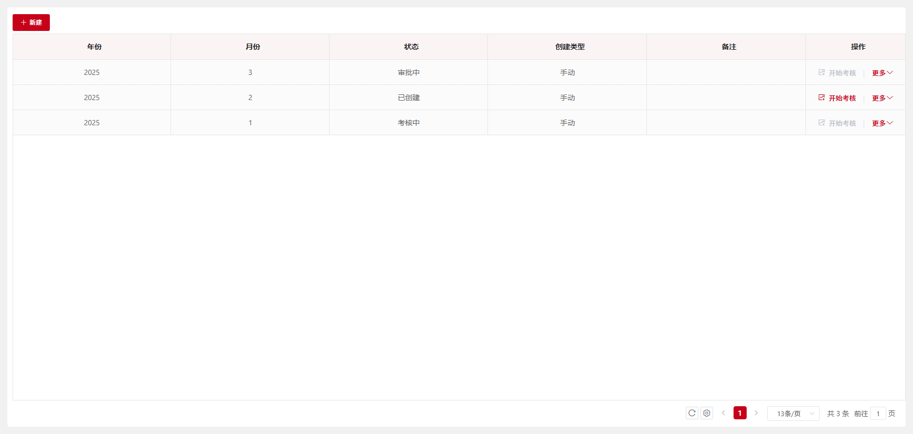1. 新建：点击新建按钮，弹出如下图所示内容;

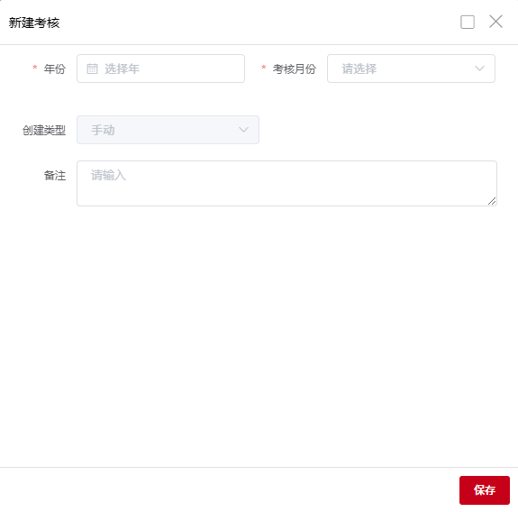

年份：选择需要考核的年份。

考核月份：新建选择月份时，如果已有该月份数据，并且状态为考核中、审批中、已完成，则该月份会被禁用不可选。如果状态不是考核中、审批中、已发布，则弹出提示“X月份已有考核记录，保存会覆盖原有记录，是否继续？”

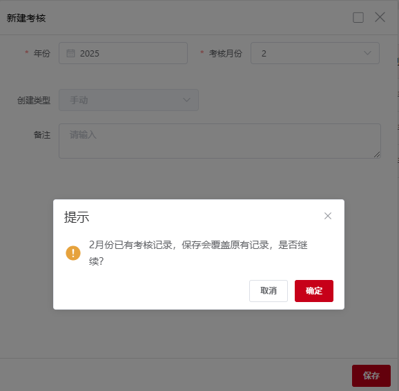

创建类型：默认为手动创建不可修改。

备注：添加考核需要注意项。

点击保存按钮则会创建一条考核记录。

 

修改：点击修改按钮弹出修改表单，只可修改备注，其他项禁用不可修改。

状态为考核中、审批中、已完成不可进行修改操作。

开始考核：点击开始考核，弹出二次确认框，点击确定后月度考核状态变为考核中。状态为考核中、审批中、已完成不可进行考核操作。

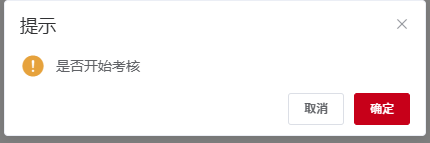

考核/查看：点击考核/查看按钮弹出考核列表页面

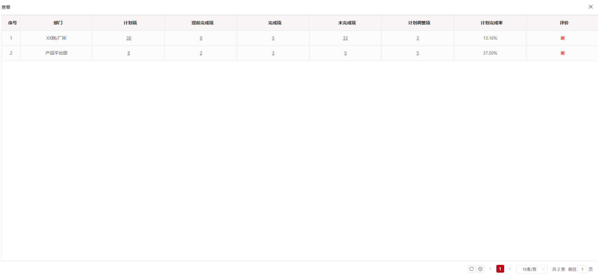

点击计划项、提前完成项、完成项、未完成项、计划调整项可打开具体的详细页面

如果状态为审批中、已完成，则只能查看考核结果

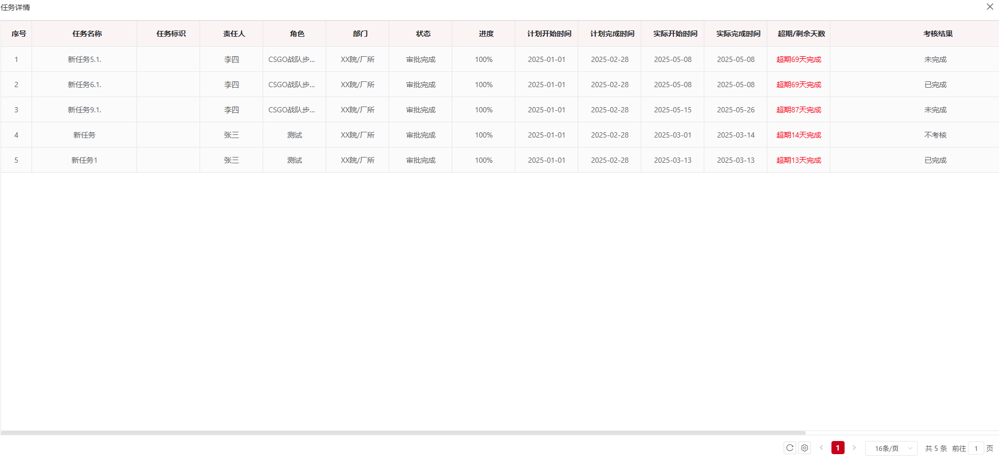

如果状态为考核中，则可以填写考核结果

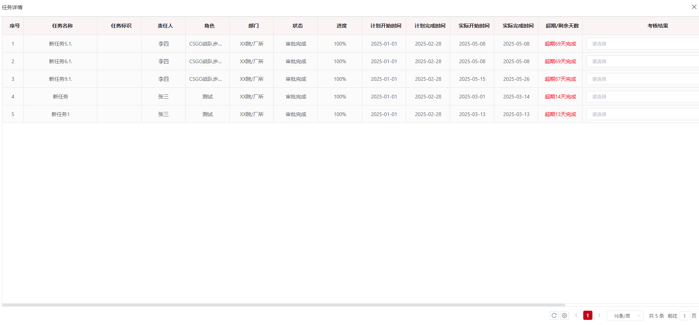

发布：点击发布按钮，弹出二次确认弹框，确认后发起计划考核发布流程，考核人提交发起-部门领导审批-公司领导审批。状态为已创建、审批中、已完成不可进行发布操作。

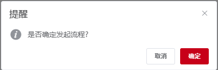

确认之后弹出提交审批页面

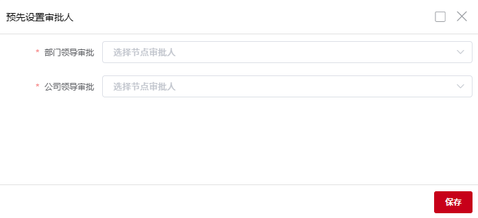

删除：点击删除按钮，弹出二次确认框，确认后物理删除月度计划考核。

状态为审批中、已完成不可进行删除操作。

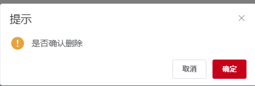

导出：点击导出按钮，导出月度计划执行快照明细。

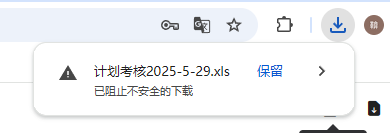