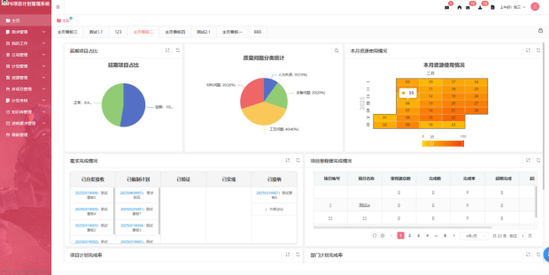
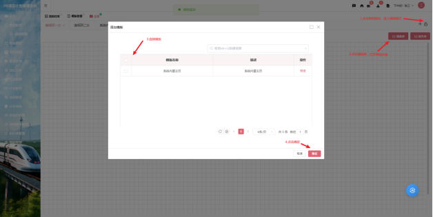
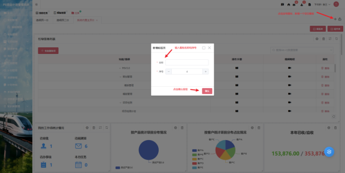
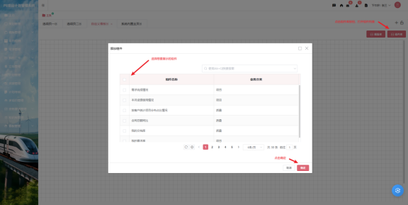
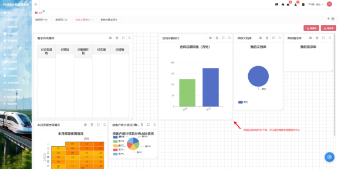
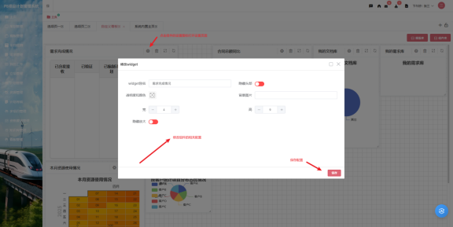
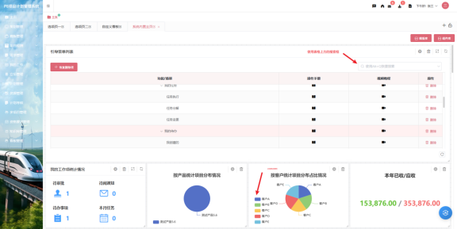
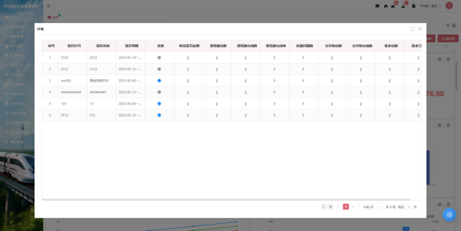
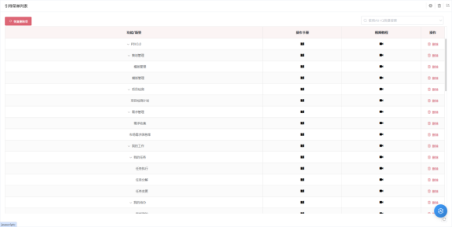

# 看板功能深入指南

### 1.  访问看板
1. 登录系统后，您会在首页看到看板界面

2. 如果没有自动显示，可以通过导航菜单找到"主页"选项

   

### 2.  添加看板
​	1. 内置看板

- 点击解锁图标进入编辑模式

- 点击添加模板按钮，打开模板列表对话框

- 从模板列表中选择模板

- 点击确定按钮，添加模板成功

  

​	2. 自定义看板

- 点击解锁图标进入编辑模式

- 点击加号图标，添加一个空白看板

- 输入看板名称和序号，点击确认

  ​		

- 这时会看到一个空白的看板，然后点击组件库按钮来打开组件列表

- 选择想要展示的组件，然后点击确认

  ​		

​	3. 调整布局

  - 将鼠标放在组件的标题栏上，通过拖拽移动组件位置

    

  - 鼠标放在组件右下角，可以调整组件大小

    

  - 支持网格对齐功能

​	4. 配置组件

  - 点击组件的设置图标

  - 设置组件别名、是否隐藏头部、颜色和透明度、背景图片、高宽、隐藏放大图标等

    

###  3.常用功能

1. 数据筛选

  - 可以通过表格上方的搜索框进行筛选

  - 支持点击图标组件的图例进行筛选

    

2. 查看详细数据

  - 表格带有下划线的列可以通过鼠标单击打开详情进行查看

  - 部分图表支持直接点击对应的数据进行查看详情

    

3. 全屏模式

   点击组件右上角放大图表可以进入全屏模式

   

