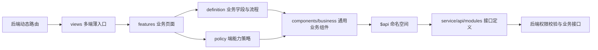

<!-- 本文档说明多端前端重构后的分层架构、目录职责和依赖规则。 -->

# 多端前端架构

## 架构图



管理端和用户端共享同一个业务页面、字段定义和接口命名空间，只注入不同的操作策略：

```js
const userPolicy = { actions: { create: true, edit: true, delete: false, changeStatus: false } }
const adminPolicy = { actions: { create: false, edit: true, delete: true, changeStatus: true } }
```

策略负责前端入口和交互控制，后端仍是最终权限边界。

## 目录结构

```text
src/
├─ views/                                      # 路由适配层，只保留动态路由要求的原始文件路径
│  ├─ ToB/                                    # 企业用户端入口；只选择 feature、mode 和少量覆盖项
│  ├─ ToC/                                    # 个人用户端入口；不再引用 ToB 或管理端内部组件
│  ├─ ToOManage/                              # 运营管理端入口；通过 mode="admin" 注入管理策略
│  └─ components/                             # 非终端专属的现有路由入口，逐步保持为薄适配页
│
├─ features/                                  # 按业务域组织的可复用业务层，不按终端复制
│  ├─ service-hall/                           # 服务大厅：六类申请、管理聚合页和租赁申请
│  │  ├─ definitions.js                       # 六类申请的字段、状态流转、API 命名空间等唯一事实源
│  │  ├─ policies.js                          # user/admin/readonly 的新增、编辑、删除、状态策略
│  │  ├─ ServiceApplicationPage.vue           # 单业务通用页面，组合 definition + policy
│  │  ├─ ServiceHallManagePage.vue            # 管理端多标签聚合页，复用相同定义
│  │  └─ lease-application/                   # 租赁申请子域；复杂表单独立维护但多端共享
│  │     ├─ definition.js                     # 租赁类型、条件字段、状态映射和数据转换
│  │     ├─ policies.js                       # 租赁用户端/管理端的记录级操作规则
│  │     └─ LeaseApplicationPage.vue          # 两端共同使用的租赁申请页面
│  ├─ public-services/                        # 公共服务业务域
│  │  ├─ policies.js                          # 查看者、编辑者和咨询处理人的能力策略
│  │  ├─ public-notice/                       # 通知公告定义与共享页面
│  │  ├─ online-consultation/                 # 在线咨询定义与共享页面
│  │  └─ document-download/                   # 资料下载定义与共享页面
│  └─ life-services/                          # 生活服务业务域
│     ├─ definitions.js                       # 人才、门票、问卷等业务配置
│     ├─ policies.js                          # 用户、管理、只读模式的能力策略
│     ├─ LifeServicePage.vue                  # 生活服务统一页面
│     └─ shuttle-bus/                         # 班车业务实现，避免管理端反向引用 ToC
│
├─ components/business/                       # 与终端无关的通用业务 UI 和交互引擎
│  ├─ ApplicationBoard/                       # 申请类 CRUD、详情、附件和状态流转组件
│  └─ ContentBoard/                           # 公告、内容和生活服务类列表/表单组件
│
├─ utils/
│  └─ actionPolicy.js                         # 统一解析布尔规则和记录级函数规则
│
└─ service/api/modules/                       # 全部 API 命名空间和接口路径的唯一存放位置
   ├─ _shared/createCrudModule.js             # 仅生成标准 CRUD 描述，减少模块样板代码
   ├─ tobServiceHall.js                       # 服务大厅与租赁接口定义
   ├─ tobPublicServices.js                    # 公共服务接口定义
   ├─ tobSupportingServices.js                # 配套服务接口定义
   └─ tocLifeServices.js                      # 生活服务接口定义
```

## 依赖规则

1. `views/ToB`、`views/ToC`、`views/ToOManage` 之间禁止相互引用。
2. 多端共享的业务状态、字段和页面放入 `features/<business-domain>`。
3. 无业务身份的通用 UI 放入 `components/business`；组件通过配置和策略工作。
4. 页面只能通过 `$api['namespace.action']` 调用接口，接口路径只在 `service/api/modules` 声明。
5. 新增端差异时优先增加策略规则或小型配置覆盖，不复制整个页面。

ESLint 已为三个终端目录增加跨端导入限制，防止架构重新退化。
