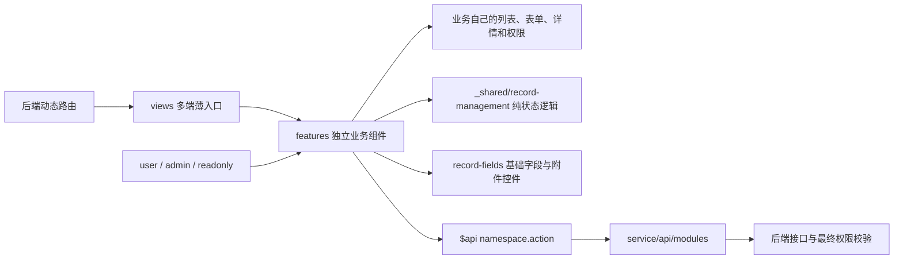

<!-- 本文档说明 ToB、ToC 与运营管理端采用“业务独立组件”后的目录职责、依赖方向和扩展规则。 -->

# 多端前端架构

## 架构图



核心原则是“一项业务，一个具名组件”。例如 `ServiceRequestPage.vue` 直接拥有服务需求的页面结构、字段和管理端按钮规则；它不再把配置交给 `ApplicationBoard` 或 `ContentBoard` 之类的万能页面。

用户端和管理端如果属于同一项业务，可以复用该业务组件，并通过 `mode` 控制新增、编辑、删除、回复或状态流转。复用范围只限于同一业务，不允许多个无关业务共同依赖一个整页组件。

## 目录结构

```text
src/
├─ views/                                             # 路由适配层：保留动态路由要求的文件位置，已迁移入口不再编写业务实现
│  ├─ ToB/                                           # 企业用户端路由入口：已迁移入口只导入对应业务组件
│  ├─ ToC/                                           # 个人用户端路由入口：不引用 ToB 或管理端目录
│  ├─ ToOManage/                                     # 运营管理端路由入口：向同业务组件传入 mode="admin"
│  └─ components/                                    # 非终端专属的历史路由入口，同样保持薄装配
│
├─ features/                                         # 业务实现层：按业务域和具体业务组织
│  ├─ _shared/                                       # 非业务共享代码；禁止放业务字段、标题或权限
│  │  └─ record-management/                         # 记录类页面的纯逻辑和基础视觉
│  │     ├─ recordManager.js                        # 无模板的 CRUD、分页、详情、附件及状态 mixin
│  │     └─ record-feature-page.scss                # 业务页面共用的布局样式，不含业务规则
│  │
│  ├─ service-hall/                                  # 服务大厅业务域
│  │  ├─ complaint-suggestion/                      # 建议投诉独立组件，包含用户提交与管理端回复
│  │  ├─ service-request/                           # 服务需求独立组件，包含受理状态流转
│  │  ├─ data-report/                               # 数据上报独立组件，包含分类和附件
│  │  ├─ media-promotion/                           # 媒体宣传独立组件，包含审核流程
│  │  ├─ qualification-recognition/                 # 资质认定独立组件，包含审核流程
│  │  ├─ resource-connection/                       # 资源对接独立组件，包含跟进流程
│  │  ├─ lease-application/                         # 租赁申请独立组件及其专属 definition/policies
│  │  └─ ServiceHallManagePage.vue                  # 管理端标签聚合，切换除租赁申请外的六个独立组件
│  │
│  ├─ public-services/                               # ToB 公共服务业务域
│  │  ├─ public-notice/                             # 通知公告独立组件及公告场景枚举
│  │  ├─ online-consultation/                       # 在线咨询独立组件，用户提问与管理回复共存
│  │  ├─ document-download/                         # 资料下载独立组件及其专属定义
│  │  ├─ enterprise-news/                           # 企业动态独立组件
│  │  ├─ park-activity/                             # ToB 园区活动独立组件
│  │  ├─ park-news/                                 # ToB 园区动态独立组件
│  │  └─ safety-column/                             # 安全专栏独立组件
│  │
│  ├─ supporting-services/                          # ToB 配套服务业务域
│  │  ├─ business-opportunity/                     # 商机资源共享独立组件
│  │  ├─ company-demand/                           # 企业需求独立组件
│  │  ├─ facility-rental/                          # 设施设备租赁独立组件
│  │  ├─ industry-association/                     # 行业协会独立组件
│  │  ├─ meeting-room-booking/                     # 会议室预定独立组件
│  │  ├─ service-organization/                     # 服务机构独立组件
│  │  └─ startup-mentor/                           # 创业导师独立组件
│  │
│  └─ life-services/                                # ToC 生活服务业务域
│     ├─ talent-service/                            # 人才服务独立组件，用户端与管理端共用本业务
│     ├─ travel-ticket/                             # 旅行门票独立组件，用户端与管理端共用本业务
│     ├─ user-survey/                               # 调查问卷独立组件，包含附件
│     ├─ park-news/                                 # ToC 园区动态独立组件
│     ├─ event-activity/                            # ToC 园区活动独立组件
│     ├─ car-rental/                                # 租车车辆独立组件
│     ├─ car-rental-info/                           # 租车申请独立组件
│     ├─ car-insurance/                             # 汽车保险产品独立组件
│     ├─ car-insurance-info/                        # 保险投保记录独立组件
│     └─ shuttle-bus/                               # 园区班车独立组件，readOnly 控制用户端能力
│
├─ components/                                      # 无业务身份的基础组件层
│  └─ business/                                     # 记录型业务可使用的低层输入控件
│     └─ record-fields/                             # 只渲染单字段，不负责列表、页面或业务权限
│        ├─ BusinessRecordField.vue                 # 输入框、选择器、日期和金额字段
│        └─ BusinessAttachmentField.vue             # 附件选择、上传限制和文件列表同步
│
└─ service/api/modules/                              # 所有 API 声明的唯一目录
   ├─ _shared/                                      # API 描述生成器目录
   │  └─ createCrudModule.js                        # 生成标准 list/add/edit/queryById/delete 描述
   ├─ tobServiceHall.js                             # 服务大厅与租赁申请接口
   ├─ tobPublicServices.js                          # ToB 公共服务接口
   ├─ tobSupportingServices.js                      # ToB 配套服务接口
   └─ tocLifeServices.js                            # ToC 生活服务接口
```

## 依赖规则

1. `views/ToB`、`views/ToC`、`views/ToOManage` 之间禁止相互导入；ESLint 已配置边界限制。
2. 一个业务目录只导出自己的具名页面，页面直接拥有模板、表格列、表单字段、详情和权限判断。
3. 同一业务跨终端时使用 `mode` 控制按钮，不复制整个业务，也不创建跨业务万能 Board。
4. `_shared` 只允许纯状态逻辑和无业务语义的样式；`record-fields` 只允许单字段级基础控件。
5. 页面通过 `$api['namespace.action']` 调用接口；URL、HTTP 方法和接口描述只能声明在 `src/service/api/modules`。
6. 后端仍是最终权限边界，前端 `mode` 与按钮判断只负责界面和交互约束。

## 新增业务约定

新增业务时，在对应 `features/<domain>/<business>/` 新建一个具名 `*Page.vue`，并在文件顶部写用途注释。业务字段和权限优先直接放在该组件；只有租赁申请这类复杂业务，才拆出本目录专属的 `definition.js` 或 `policies.js`。随后在 `views` 增加薄路由入口，并在 `service/api/modules` 对应模块声明 API。

尚未纳入本次重构的历史独立页面可以继续运行，但后续修改时应按同一规则逐步迁入 `features`，避免再次在 `views` 中扩展业务实现。
