> 
> 
>
> ##### P8-基于流程和知识的研发项目管理系统用户手册

| \[ \] 草稿            |        | 当前版本： | > P8V3R1_3.1._20250822_beta_FjG |
| \[√\]正式发布    |        |                     |                                     |
| \[ \] 正在修改    |        |                     |                                     |
|                         |        | 完成日期： | > 2025 年 8 月22日                |
+------------------+--------+------------+-------------------------------------+

目录

[一、产品介绍 [3](#一产品介绍)](#一产品介绍)

[二、编写目的 [3](#二编写目的)](#二编写目的)

[三、系统功能划分 [3](#三系统功能划分)](#三系统功能划分)

[四、运行环境 [4](#四运行环境)](#四运行环境)

[五、系统角色及权限说明[5](#五系统角色及权限说明)](#五系统角色及权限说明)

[1. 角色权限 [5](#角色权限)](#角色权限)

[六、具体操作步骤1.系统登录[6](#六具体操作步骤1.系统登录)](#六具体操作步骤1.系统登录)

[1.1 登录 [6](#登录)](#登录)

[2.1. 系统页头 [9](#系统页头)](#系统页头)

[2.2. 标签页 [13](#标签页)](#标签页)

[2.3. 操作按钮 [13](#操作按钮)](#操作按钮)

[2.4. 必填项 [14](#必填项)](#必填项)

[2.5. 分页 [14](#分页)](#分页)

[3. 系统功能 [15](#3.系统功能)](#3.系统功能)

[3.1. 需求管理 [15](#需求管理)](#需求管理)

[3.2. 我的工作 [17](#我的工作)](#我的工作)

[3.3. 沟通管理 [27](#沟通管理)](#沟通管理)

[3.4. 立项管理 [30](#立项管理)](#立项管理)

[3.5. 计划管理 [36](#计划管理)](#计划管理)

[3.6. 计划考核 [58](#计划考核)](#计划考核)

[3.7. 资源管理 [60](#资源管理)](#资源管理)

[3.8. 多项目管理 [64](#多项目管理)](#多项目管理)

[3.9. 知识库管理 [67](#知识库管理)](#知识库管理)

[3.10.任职资格要求管理 [84](#任职资格要求管理)](#任职资格要求管理)

[3.11看板管理 [93](#看板管理)](#看板管理)

[3.12 功能设置 [96](#功能设置)](#功能设置)

[3.13 系统日志 [139](#系统日志)](#系统日志)

[3.14 系统管理 [140](#系统管理)](#系统管理)

# 一、产品介绍

> P8 是秉承融智 IPD咨询管理理论体系，融汇十余载我国军工集团级企业和中车等大型制造业的管理信息化建设经验，由融智软件自主研发的企业级项目计划管理系统，适用于军工科研院所及创新型研发企业。能够帮助企业建立以项目管理为标准，以产品实现流程为主线，以 WBS 方法为基础，以 IT技术为支撑的一体化的服务于研制生产管理部门的项目管理平台。
>
> P8产品的核心理念是作为企业产品研制生产的总驱动器，将企业的数字化协同设计 PDM、数字化精益生产 ERP等业务系统有机连通，构成企业数字化运营平台，使企业研制和生产的运行通畅、协调高效。
>

# 二、编写目的

> 为了帮助用户更好地了解和使用该软件，提高用户与软件的亲和度。操作手册讲述怎样
> 配置和使用该系统，以及该软件使用过程中应注意的一些问题。

# 三、系统功能划分

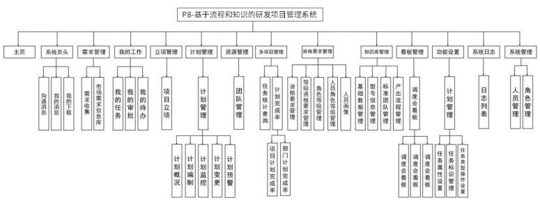

# 四、运行环境

> 硬件环境：

+:-----------------------------------:+:------------------------------------------------------:+
| > 数据库服务器硬件配置                                                                       |
+-------------------------------------+--------------------------------------------------------+
| CPU                                 | P4 3.0                                                 |
+-------------------------------------+--------------------------------------------------------+
| 内存                                | 16G                                                    |
+-------------------------------------+--------------------------------------------------------+
| 硬盘                                | 1TB                                                    |
+-------------------------------------+--------------------------------------------------------+
| > 应用服务器硬件配置                                                                         |
+-------------------------------------+--------------------------------------------------------+
| CPU                                 | P4 3.0                                                 |
+-------------------------------------+--------------------------------------------------------+
| 内存                                | 8G                                                     |
+-------------------------------------+--------------------------------------------------------+
| 硬盘                                | 1TB                                                    |
+-------------------------------------+--------------------------------------------------------+
| > 客户端硬件配置                                                                             |
+-------------------------------------+--------------------------------------------------------+
| CPU                                 | P4 2.0                                                 |
+-------------------------------------+--------------------------------------------------------+
| 内存                                | 1G                                                     |
+-------------------------------------+--------------------------------------------------------+
| 硬盘                                | 250GB                                                  |
+-------------------------------------+--------------------------------------------------------+

> 软件环境：

+:-----------------------------------:+:------------------------------------------------------:+
| > 数据库服务器软件配置                                                                       |
+-------------------------------------+--------------------------------------------------------+
| 操作系统                            | Windows2012 Server                                     |
+-------------------------------------+--------------------------------------------------------+
| 数据库系统                          | PosgreSQL                                              |
+-------------------------------------+--------------------------------------------------------+
| 数据库设计                          | Sybase PowerDesigner(R) Version 12.5.0.2169            |
|                                     |                                                        |
| 工具                                |                                                        |
+-------------------------------------+--------------------------------------------------------+
| > 应用服务器软件配置                                                                         |
+-------------------------------------+--------------------------------------------------------+
| 操作系统                            | Windows2012 Server/Linux                               |
+-------------------------------------+--------------------------------------------------------+
| 应用服务器                          | JBoss 4.0.2及以上版本/tomcat 9及以上                   |
+-------------------------------------+--------------------------------------------------------+
| > 客户端软件配置                                                                             |
+-------------------------------------+--------------------------------------------------------+
| 操作系统                            | WindowsXP 以上版本                                     |
+-------------------------------------+--------------------------------------------------------+
| 浏览器                              | Internet Explore 6.0 、Internet Explore 8.0 或 Google  |
|                                     | Chrome                                                 |
+-------------------------------------+--------------------------------------------------------+
| > 网络通讯协议                                                                               |
+----------------------------------------------------------------------------------------------+

+-------------------------------------+--------------------------------------------------------+
| 操作系统                            | WindowsXP 以上版本                                     |
+-------------------------------------+--------------------------------------------------------+
| TCP/IP协议                          | 因特网通用标准协议                                     |
+-------------------------------------+--------------------------------------------------------+
| > 开发工具                                                                                   |
+-------------------------------------+--------------------------------------------------------+
| Eclipse                             | Eclipse基金会                                          |
|                                     |                                                        |
| 3.3                                 |                                                        |
+-------------------------------------+--------------------------------------------------------+
| JDK1.6                              | SUN公司                                                |
+-------------------------------------+--------------------------------------------------------+

# 五、系统角色及权限说明

## 角色权限分类

- 处领导

拥有项目发布审批权限

- 计划调度

菜单可查看计划管理模块权限

可对计划进行调度，编辑计划信息，查看计划进度
可对计划进行计划变更，计划执行

- 项目成员

可查看项目立项列表

参与项目进度，新建维护项目

- 部门领导

拥有项目发布审批权限拥有计划发布审批权限

可对计划统计列表及看板数据进行查看

- 所领导

拥有项目审批发布权限

可对计划统计列表及看板数据进行查看

## 公共角色权限

- 安全保密管理员

查看日志权限

管理人员权限:为成员添加角色角色管理权限

- 实施人员

系统管理

业务流程管理系统设置

组件管理 数据源管理

## 分角色登录说明

使用不同角色登录系统时，可查看的菜单以及审批内容，审批权限都不同，每个角色都
拥有对应的权限，具体权限设置可登录安全保密管理员账号，将进入角色管理中，对角色的
权限进行编辑修改

# 六、具体操作步骤

## 1系统登录

### 1.1登录

打开 Google Chrome
浏览器，在地址栏中输入服务器地址，点回车，就可以看到《P8-基于流程和知识的研发项目管理系统》的登录界面。如下图所示：

图 1.1-1

在上图文本框中输入用户名和密码，点击【登录】即可登录系统，进入系统首页，不同权限的用户，系统首页中显示不同的菜单。系统初始用户名为姓名全拼，初始密码为
000000。

登录不同角色账号所进入的系统菜单与权限不同

登录账号
safeAdmin（密码：1），角色为安全保密管理员，可进行日志查看，角色人员编辑配置等，菜单页面如下图：

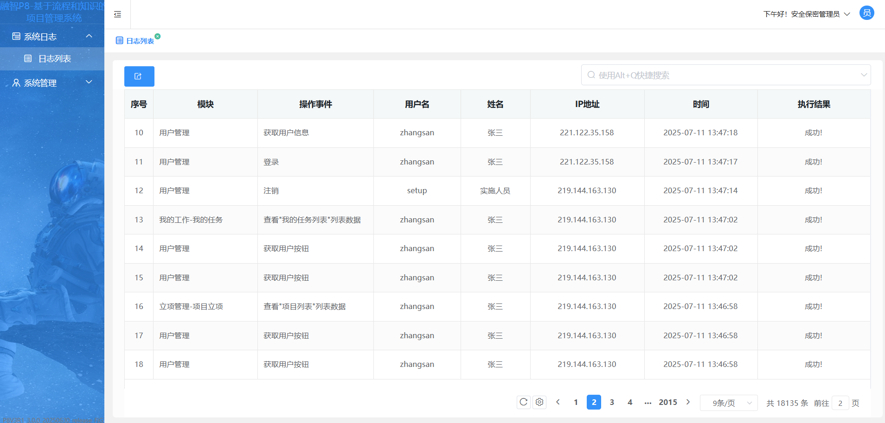

图 1.1-2

登录账号
setup(密码：1)，角色为实施人员，可对系统进行配置，如菜单，图标，状态，字段等，菜单页面如下图：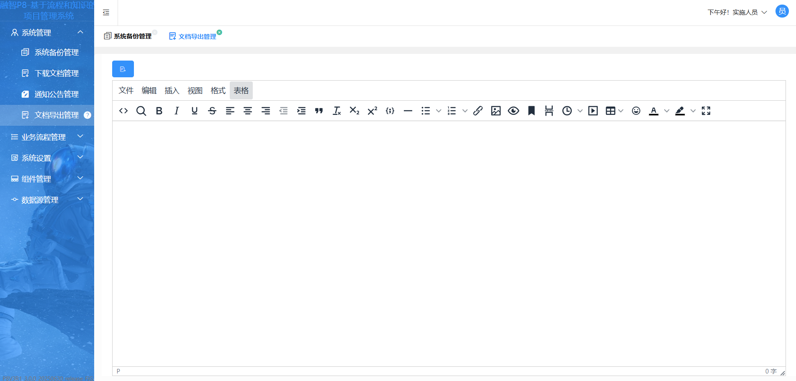

图 1.1-3

登录系统人员账号，如
zhangsan(密码：1)，可查看系统菜单，进行业务操作，如项目立项、计划管理等，菜单页面如下图：

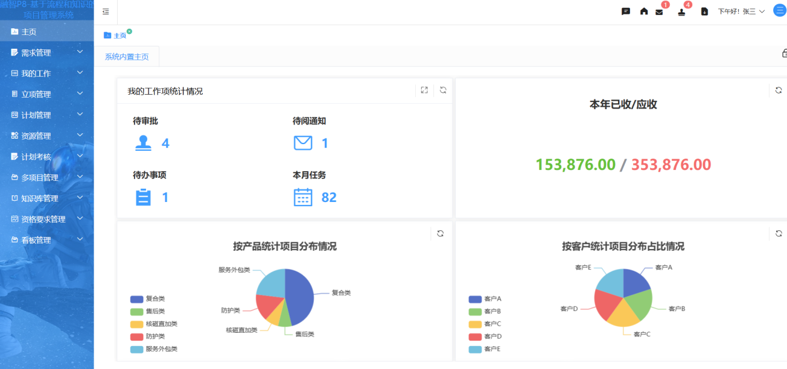

图 1.1-4

## 2公共部分说明

### 2.1系统页头

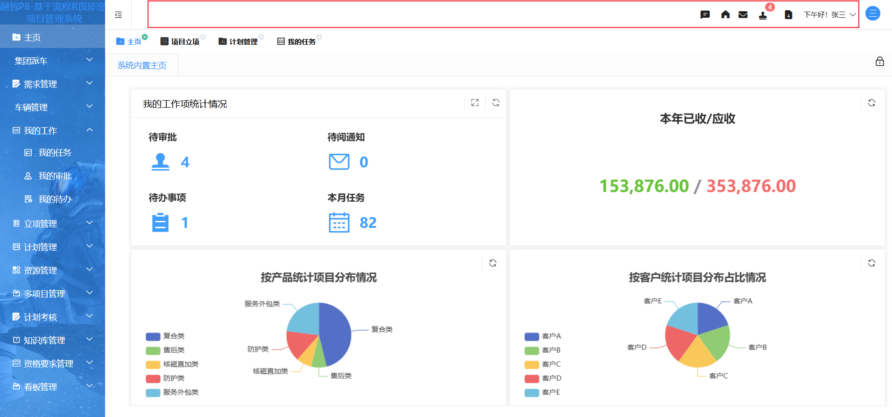{width="5.9625in" height="2.79375in"}

图 2.1-1

- 为菜单缩放按钮，点击可收缩系统菜单栏

  ● 为沟通面板，点击可与项目内其他人员进行沟通，如下图所示:

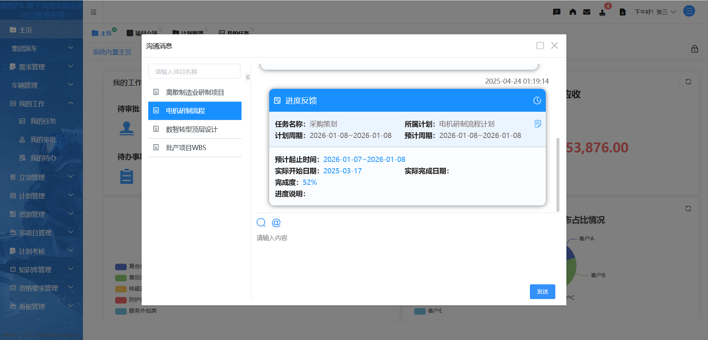

图 2.1-2

● 为我的主页功能，点击可回到系统首页

● 为我的消息，点击可展开消息列表页面，查看我接收到的消息，如下图所示:

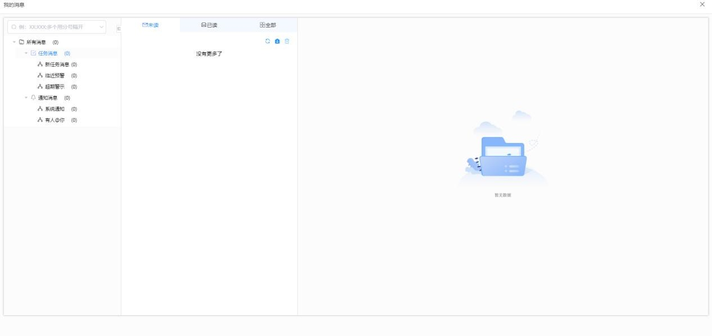

图 2.1-3

● 为我的审批，点击可打开我的审批页面，查看审批消息，页面如下图所示:

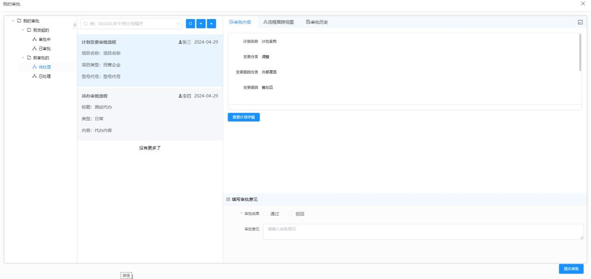

图 2.1-4

● 为我的下载，点击可打开我的下载页面，查看已下载的文档，如下图所示:

图 2.1-5

- 点击"下午好，XX人员"，可下拉出功能列表，包括:修改密码，个性化设置，注销

- 点击修改密码，出现修改密码页面，修改后需重新登录，修改密码页面如下图所示：

图 2.1-6

- 点击个性化设置，可对系统设置，主题，菜单栏背景图进行修改，修改后自动保存，个
  性化设置页面如下图所示：

图 2.1-7

- 点击注销，弹出提示窗，点击确认后可返回到登录页面，进行重新登录或切换账号登录，
  弹出窗口页面如下图所示:

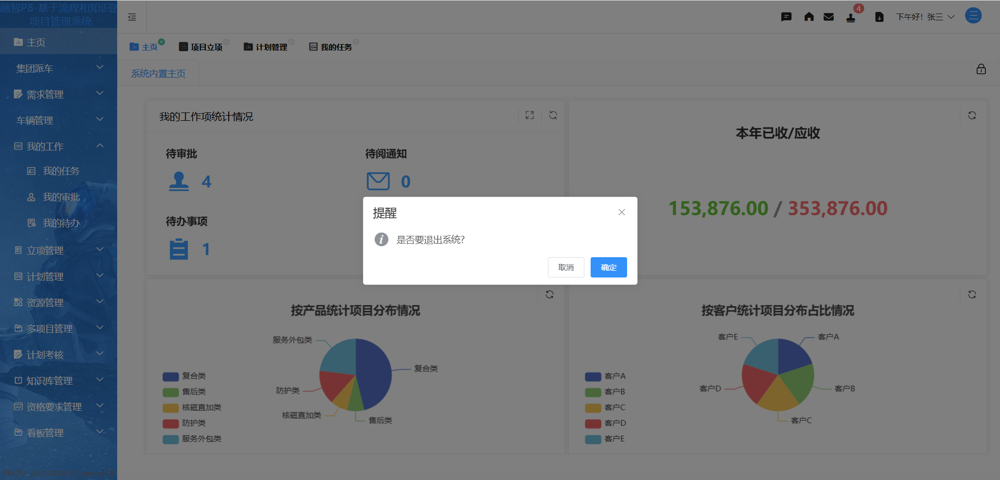

图 2.1-8

### 2.2标签页

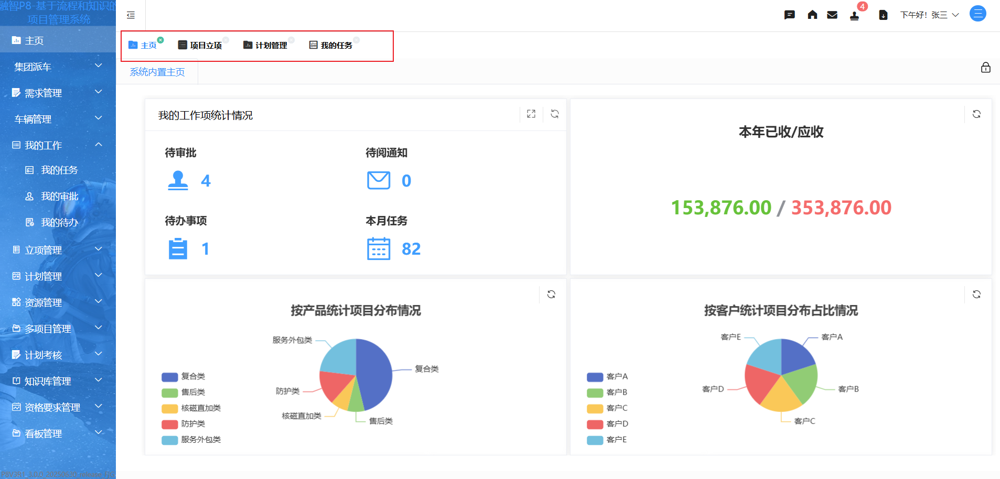

图 2.2-1

- 用户点击左侧的菜单后，在头部下方会添加相应的菜单标签，便于历史菜单的切换。

- 点击标签页也会跳转到对应页面，例如点击上方的主页，会跳转到主页面

- 点击标签右上方的×按钮，可删除该标签

### 2.3操作按钮

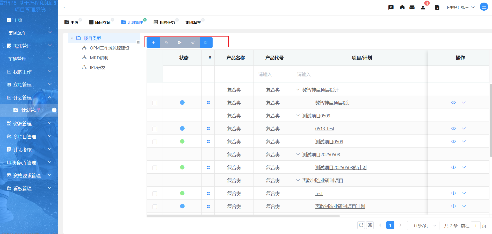

图 2.3-1

- 列表表头上方为操作按钮区域，点击相应按钮可进行操作

- 查询:可进行选择或输入数据进行查询

### 2.4必填项

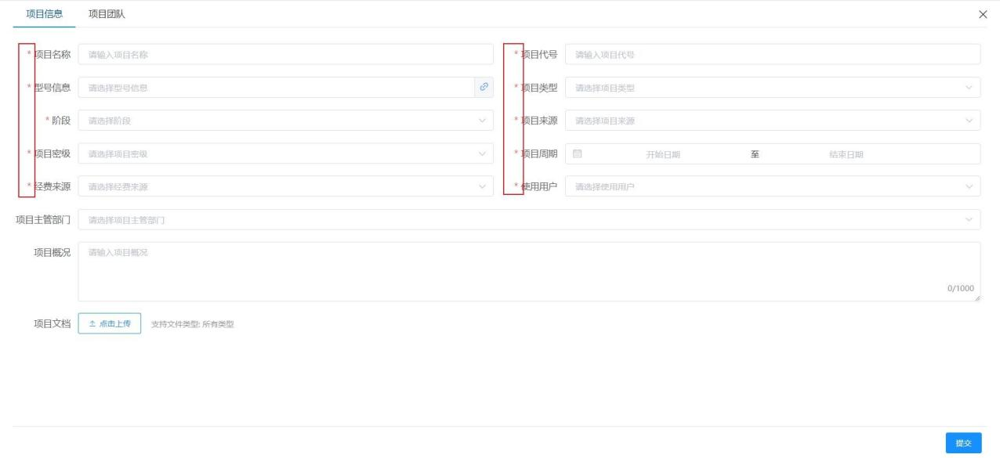

图 2.4-1

- "\*"进行标注的均为必填项，如果必填项为空，则无法成功保存数据

### 2.5分页

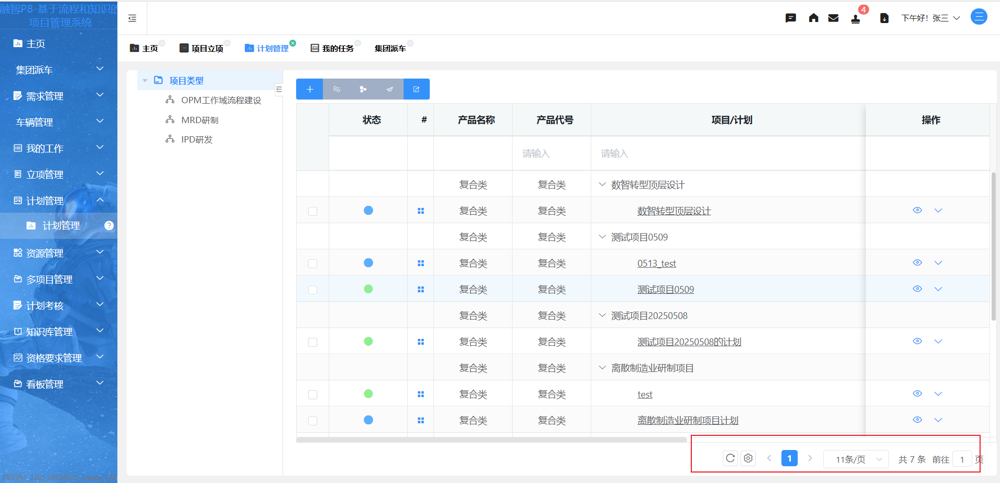

图 2.5-1

- 分页在页面最下方进行展示

- 点击页数可快速跳转到指定页

- XX 条/每页，用于控制每页所展示的数据条数

- 前往 XX 页，输入数字可快速跳转到对应页数

- 共 XX 页，用于统计页数总数

## 3需求管理

### 3.1需求收集

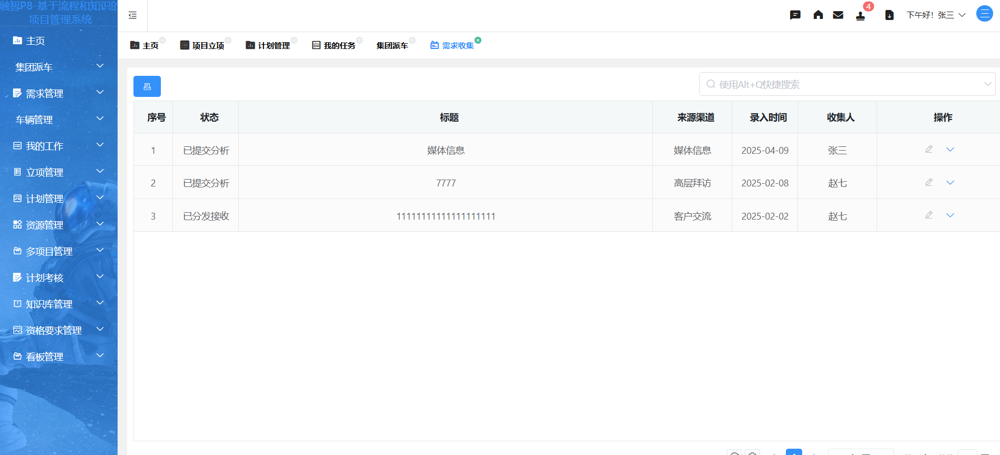

图 3.1.1-1

（a）点击收集按钮进入渠道模板选择界面

（b）点击修改按钮进入该信息修改界面

（c）点击提交，将本条需求收集信息提交至需求信息录入人员处进行规范整理

收集渠道选择界面：

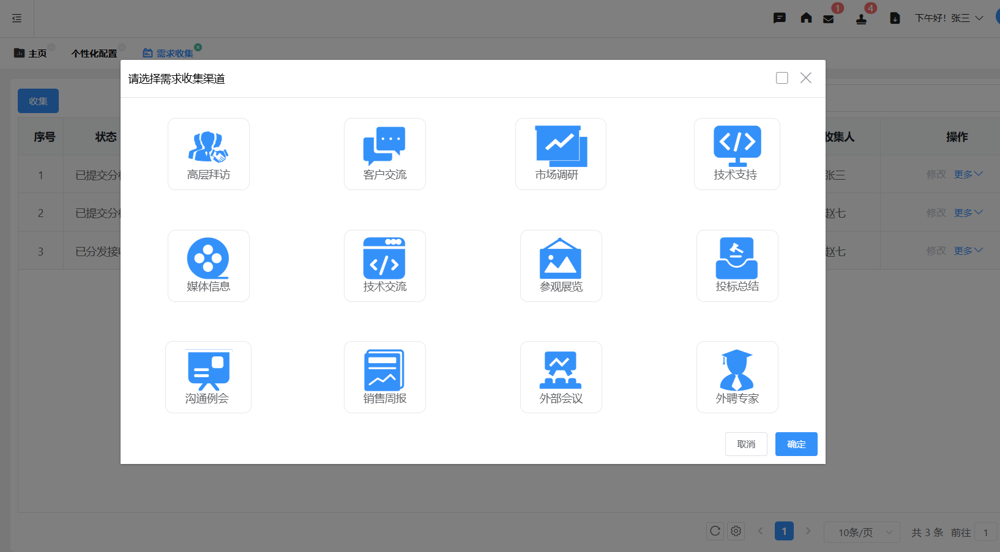

图 3.1.1-2

（a）能够高亮显示选择的渠道，点击确定后进入该渠道的需求信息录入界面

需求信息录入界面：

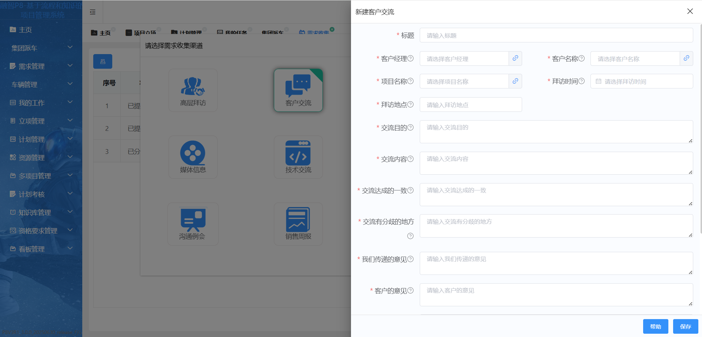

图 3.1.1-3

### 3.2市场需求信息库

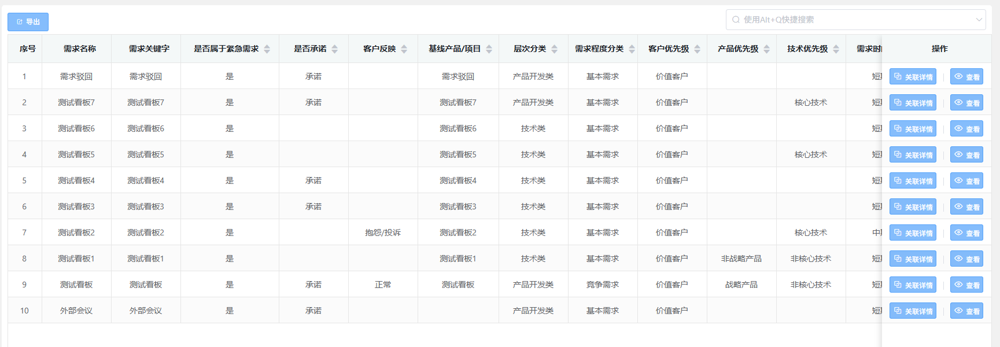

图 3.1.2-1

需求管理人员在需要对市场需求信息进行查询，如按时间窗、分类、客户等条件进行检索时，可通过该功能进行

### 3.3在R1中与项目计划管理关联

审批通过的需求可与具体计划任务进行关联

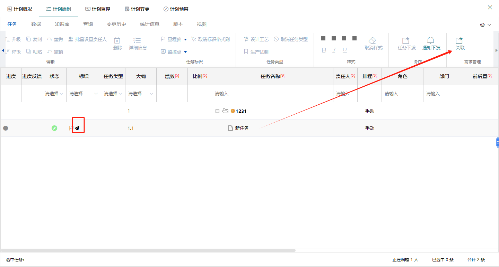

图 3.1.3-1

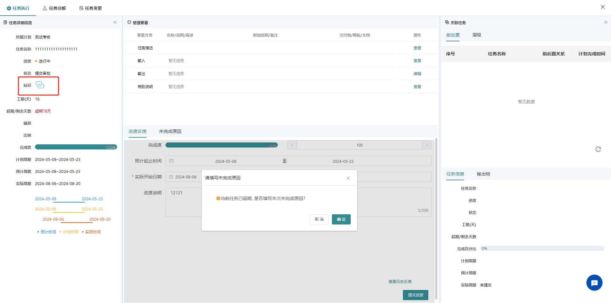{width="6.364583333333333in"
height="3.1597222222222223in"}

图 3.1.3-2

存在关联信息的任务，在计划编辑、计划监控、我的任务列表等界面的标识列使用图标进行明显标识。

## 4我的工作

### 4.1我的任务

#### 4.1.1已发布-列表

我的任务分为两个 tab页，分别为已发布页面以及协同编制页面，已发布页面展示已进行下发的任务，登录有相关权限的账号可查看，已发布列表如下图所示:

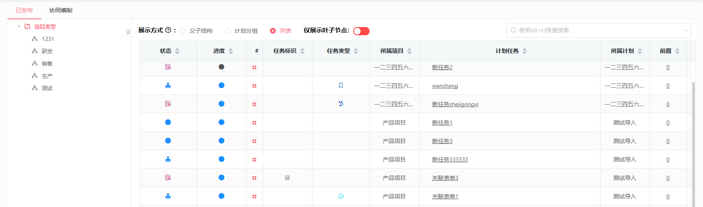

图 3.2.1.1-1

- 列表展示的数据为计划编制页面下发成功的数据，查看权限为当前登陆人需是所下发任务的责任人，列表默认展示未完成和进行中的任务，已完成的任务需在查询中搜索后查看

- 列表进度标识以颜色区分不同状态的数据，
  为未开始，
  为进行中，
  审批驳回以及审批撤销.列表目前显示的图标颜色及行状为默认状态，可自行根据需要更改

- 点击展示方式可切换展示效果，打开仅展示叶子节点只能看见没有子任务的任务

- 点击#字段或带下划线的字段，可进入任务执行/任务分解/任务变更页面进行操作

#### 4.1.2已发布-任务执行

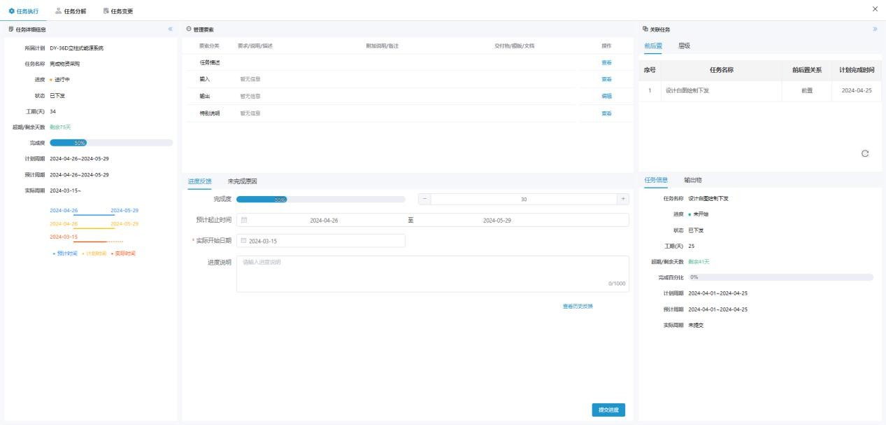

图 3.2.1.2-1

- 任务执行页面布局分为左中右，左边展示任务基本信息，如任务名称，状态等.中间展示前后置，输出物以及任务进度填写.右边展示层级关系

- 进度反馈中，填写进度并点击提交进度按钮，会根据进度情况改变任务状态，如进度为0
  时，任务状态为未开始;进度为 1-100
  之间，点击提交进度按钮，任务状态为进行中; 进度为100
  时，出现提交审批按钮，可对该数据进行提交审批，审批完成后，任务状态为已完成

- 输出列的编辑按钮，点击可上传输出物，填写输出物名称，保存后可在列表进行展示

- 注:如任务截止时间超出预计完成时间时，进度填写页面可填写超期原因并进行反馈，
  反馈信息可在任务对应的计划编制页面进行查看

#### 4.1.3已发布-任务分解

任务分解页面可对当前任务进行分解，新建下级或同级任务，功能界面与计划编制页面一致，页面如下图所示:

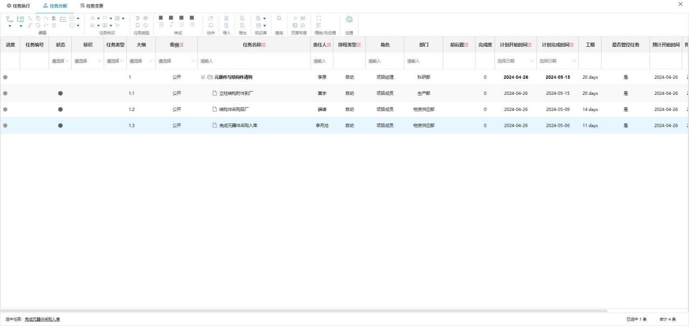

图 3.2.1.3-1

#### 4.1.4已发布-任务变更

> 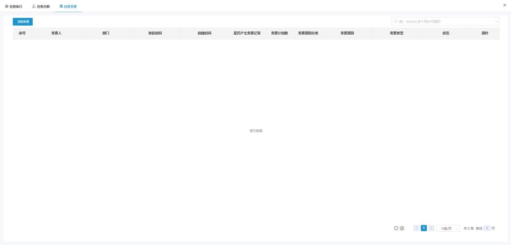
>
> 图 3.2.1.4-1
>
> 任务变更页面可以对任务的名称，时间，标识等信息进行变更，如下图所示:

- 点击发起变更，可选择本任务以及其下级任务进行变更，变更只能选择未审批完成、已下发、未下发、审批驳回的数据，变更完成后点击保存，保存后点击提交，可进行变更审批，审批中时时，
  据状态为变更中

- 发起变更时会跳转至计划编制页面，可选择任务进行变更，并对任务内容进行更改，如
  下图所示:

> 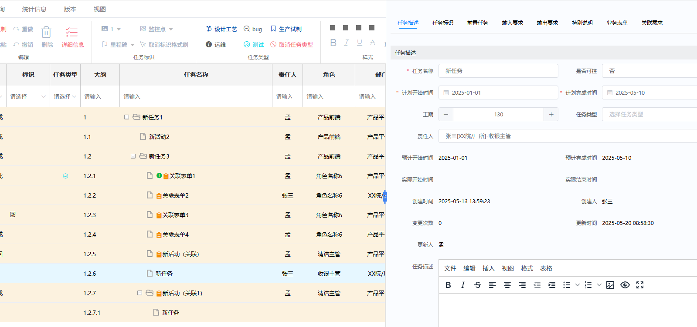图 3.2.1.4-2
>

- 修改内容保存后，点击保存，数据保存后可提交审批，提交审批页面如下图所示:

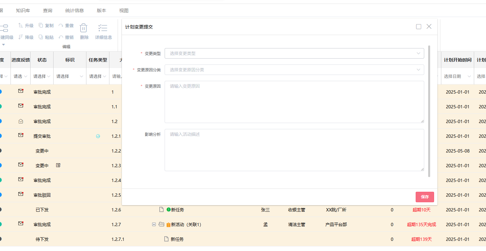

图 3.2.1.4-3

### 4.2协同编制-列表

协同编制列表展示计划管理分发统筹的任务，页面如下图所示:

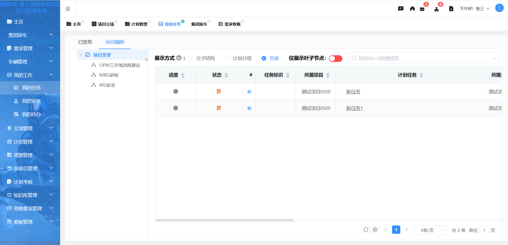

图 3.2.1.5-1

- 点击#字段或带下划线的字段，可进入任务执行/任务分解/任务变更页面进行操作，具
  体操作步骤与已发布中一致

### 4.3我的审批

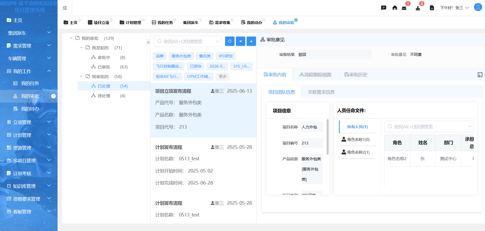

图 3.2.2-1

- 左侧列表点击可切换不同类型的审批数据

- 点击右侧详情页面上方
  tab页，可查看数据的审批内容/流程跟踪视图/审批历史.流程跟踪视图页面可当前审批数据的审批流程及当前所在的审批节点，页面如下图所示:

> 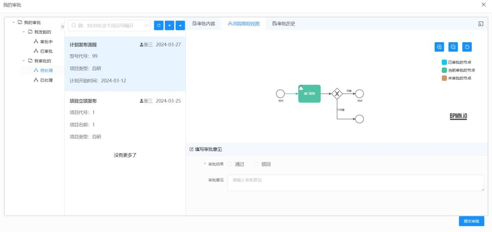
>
> 图 3.2.2-2

- 审批历史页面可查看审批记录，如下图所示:

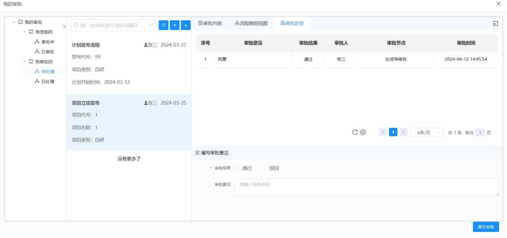

图 3.2.2-3

- 可操作数据为所登录账号权限内的数据，如拥有部门领导角色的账号，可对项目数据进
  行审批

- 点击查看计划详情按钮，弹出计划详情页面，可对计划进行查看，如下图所示:

> 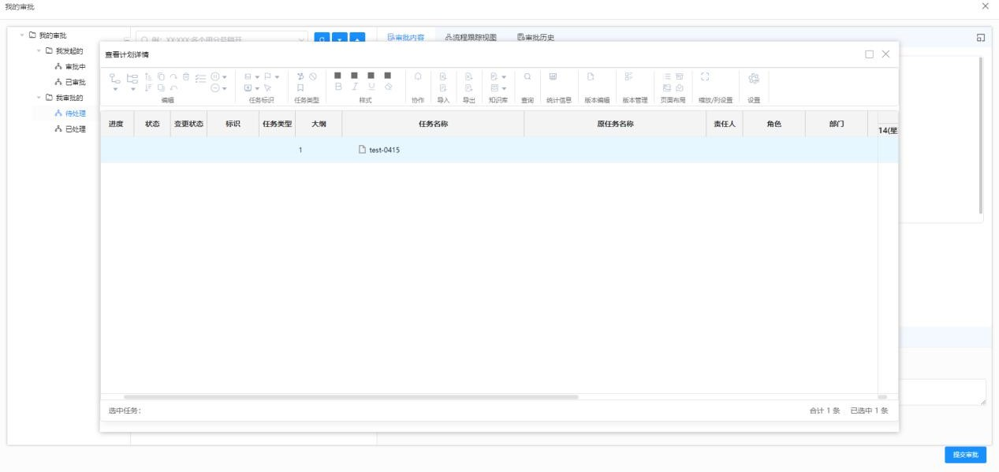图 3.2.2-4
>

- 点击选择审批意见，同意则代表审批通过，不同意则代表审批被驳回，点击提交审批按钮，会出现是否确认弹窗，如下图所示: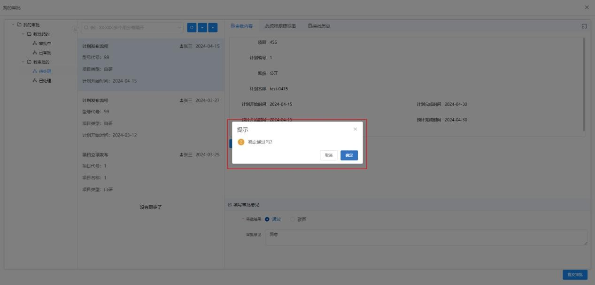

图 3.2.2-5

### 4.4我的待办

1.  我创建的

我的待办分为两个tab
页展示，分别为我创建的和我接收的，我创建页面如下图所示:

> 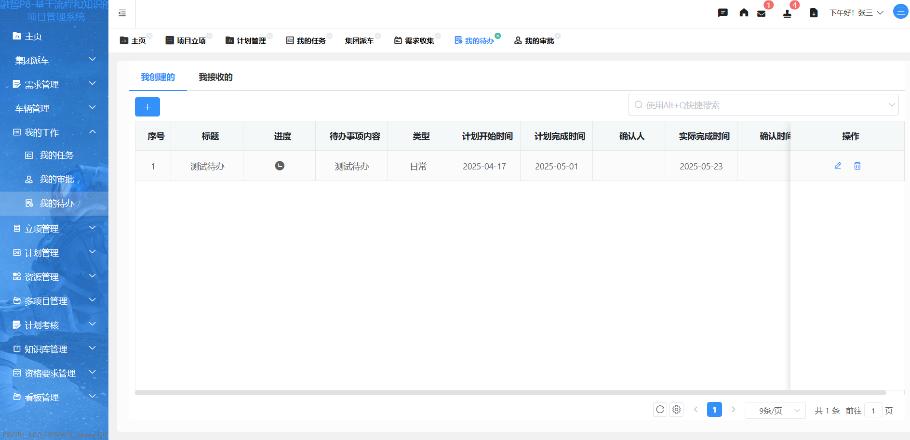图 3.2.3-1
>

- 点击列表的新建按钮，弹出新建页面，填写基本信息后点击保存，新建页面如下图所示:

  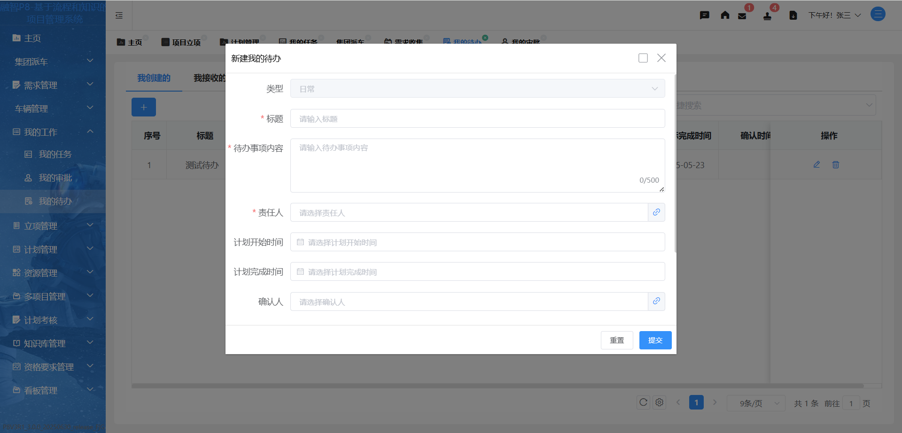

图 3.2.3-2

- 点击删除按钮，可将列表数据删除，删除前出现是否删除提示，确认后可删除数据，如
  下图所示:

> 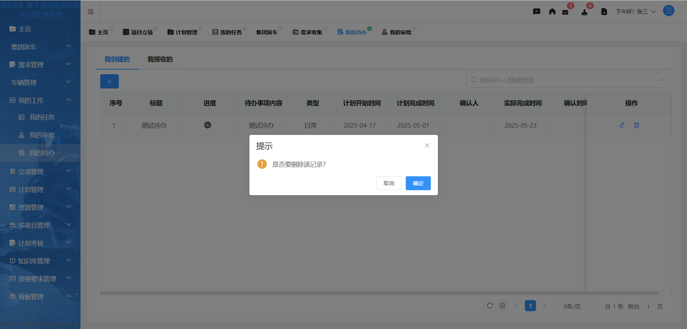图 3.2.3-3
>

- 点击修改按钮，出现修改页面，将需要修改的数据修改完成后，点击保存修改后的数据，
  修改页面如下图所示:

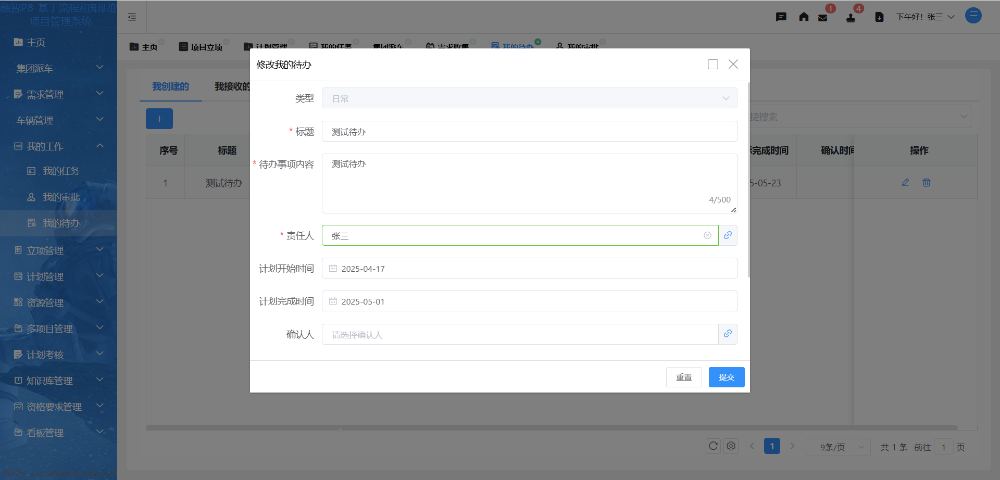

图 3.2.3-5

- 新建时创建数据，如责任人与确认人不同，在我接收的页面可提交审批，点击我接收的，
  切换至我接收的页面.

  1.  我接收的

> 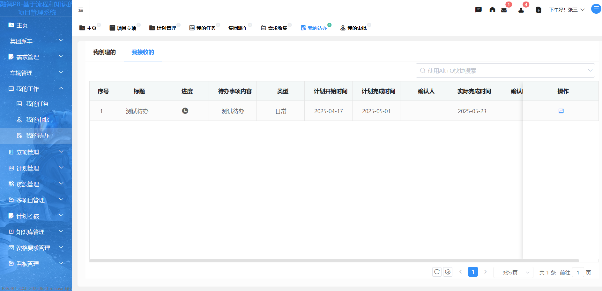图 3.2.3-6
>

- 点击执行按钮，弹出待办事项执行窗口，填写起止时间后，选择保存或直接发起审批.
  页面如下图所示:

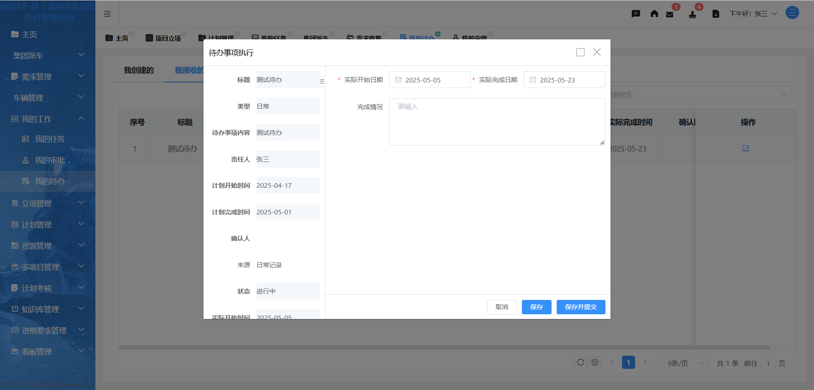

> 图 3.2.3-7

- 审批发起后，登录确认人账号进行审批

## 5沟通管理

### 5.1主界面入口

点击右上角消息按钮即可进入沟通页面

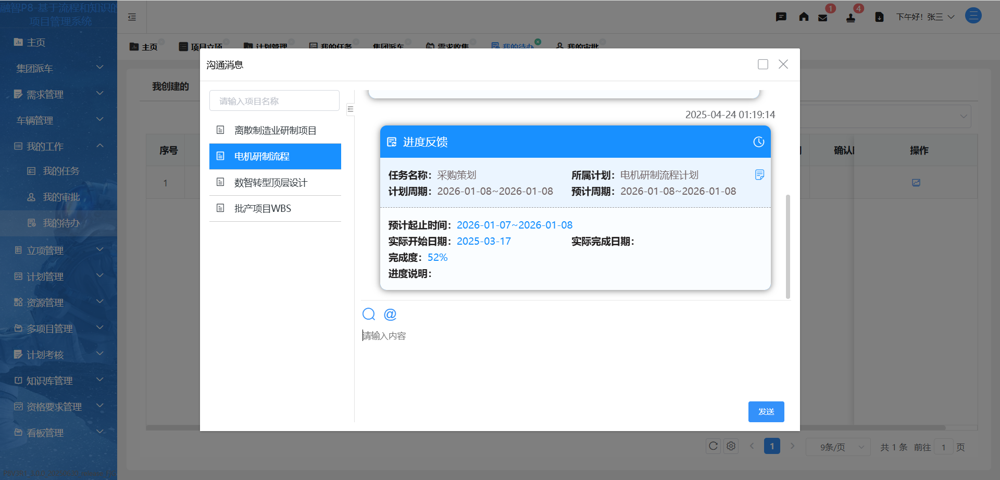

图 3.3.1-1

点击@可打开项目成员列表,选择成员可提醒该成员

### 5.2我的任务入口

进入我的任务-点击右下角沟通按钮

填写下方进度反馈后提交,会自动发送该进度反馈信息

> 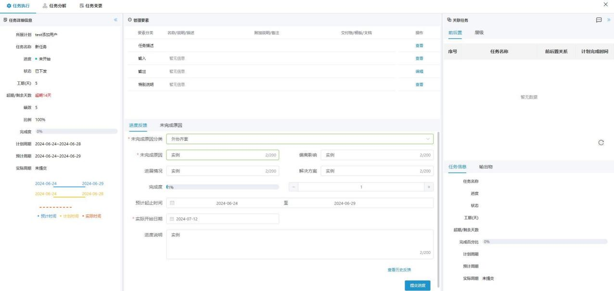图 3.3.2-1
>

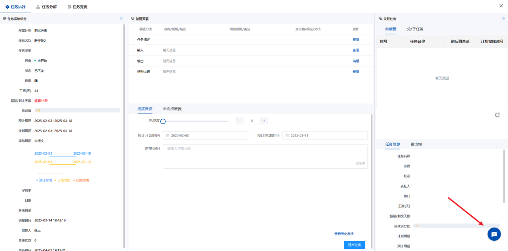

> 图 3.3.2-2

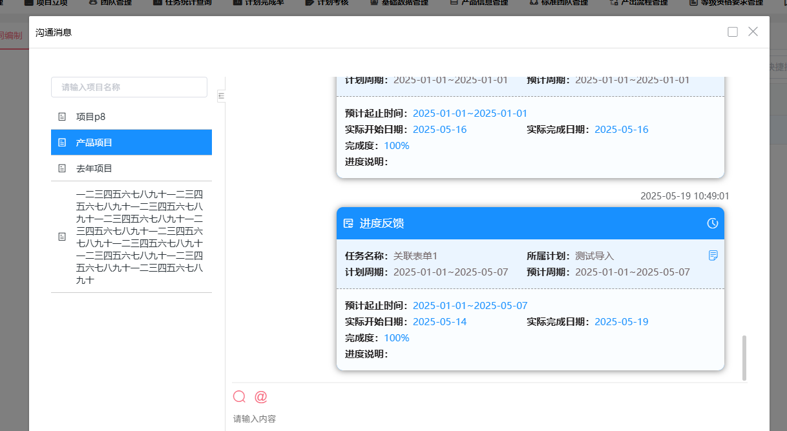

> 图 3.3.2-3

## 6立项管理

### 6.1项目立项列表

项目立项列表展示当前登录用户权限下所有的立项信息，如下图所示:

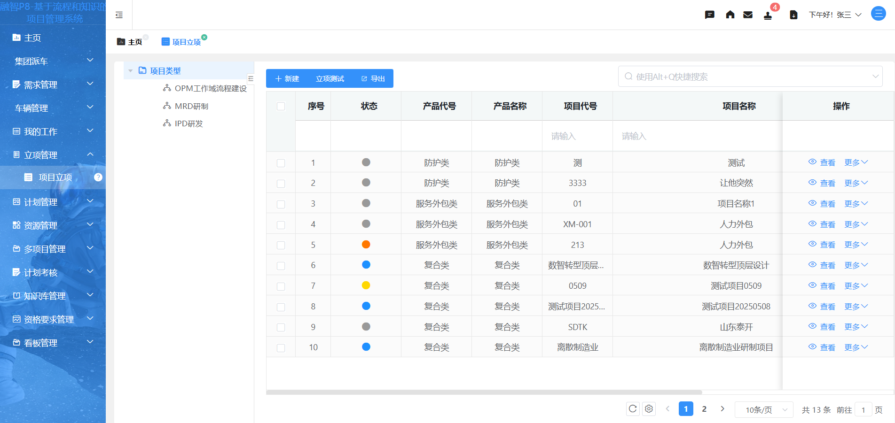

图 3.4.1.1-1

- 左边项目类型导航树可根据项目类型对列表的项目数据进行筛选，右边为列表展示区及功能区，展示列表数据，并可以进行功能操作.

- 列表状态以颜色区分不同状态的数据，
  为已保存状态，可对数据进行删除，修改， 查看操作;
  为已发布状态，可进行暂停，权限设置，完成操作;
  为已暂停状态，可进行重启操作;

为已完成状态，已完成状态的数据不可进行操作;
为审批中状态，可进行查看流程图，撤回流程操作;
为已驳回状态，可进行修改，发布，删除操作.状态图标以及颜色目前为默认状态，可根据需要自行修改。

- 点击新建按钮进入新建页面。

### 6.2项目新建

> 在新建页面填写项目基本信息，带
> 的字段为必填项，新建页面如下图所示:
>
> 
>
> 图 3.2.1.2-1

- 项目信息编辑完成后，点击"保存"按钮即可成功在列表生成一条立项记录，状态为"已保存"。已保存状态的项目点击列表上的修改按钮进行修改信息。

### 6.3项目修改

未发布的列表项目可行进行修改，点击修改按钮，进入修改页面，如下图所示:

> 图 3.2.1.3-1
>
> 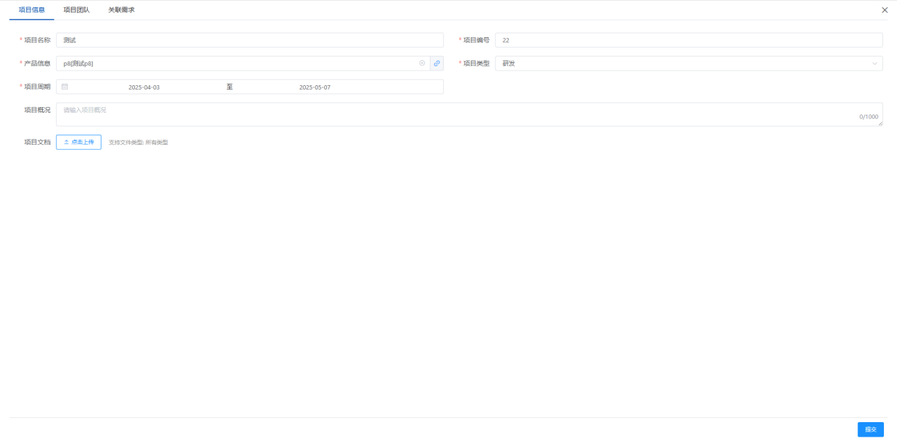
>
> 图 3.2.1.3-2

- 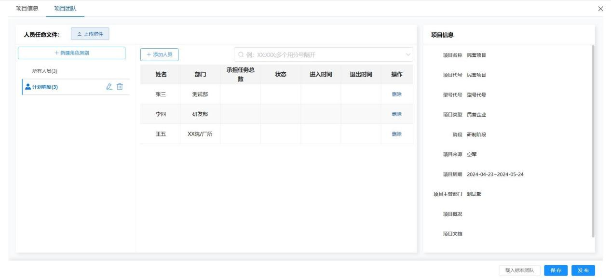修改完成后点击保存按钮，可将修改后的项目数据保存，项目信息修改完成后，点击项目团队可切换到团队成员设置页面，为项目添加团队成员，页面如下图所示:

图 3.2.1.3-3

- 点击新建角色类别，添加完成后，为角色类别添加成员，点击保存按钮可保存添加数据，点击载入标准团队按钮，可将设置好的角色类别添加至页面中，如下图所示:

> 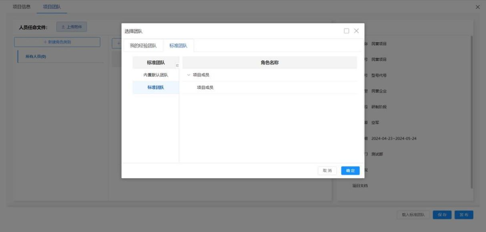
>
> 图 3.2.1.3-4

点击关联需求，可为改项目绑定需求

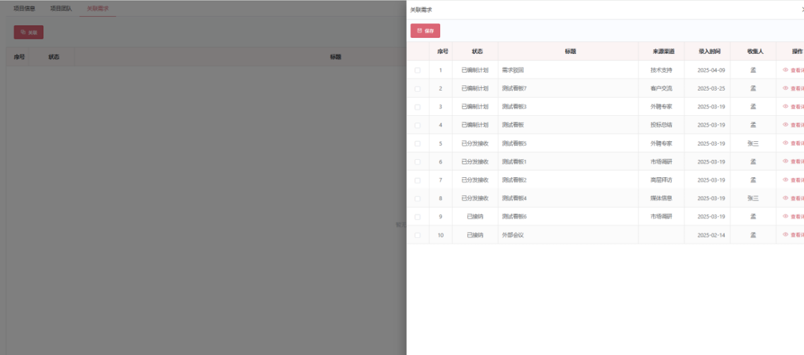

### 6.4项目删除

> 点击列表删除按钮，弹出确认提示，点击确认后可删除项目，如下图所示:

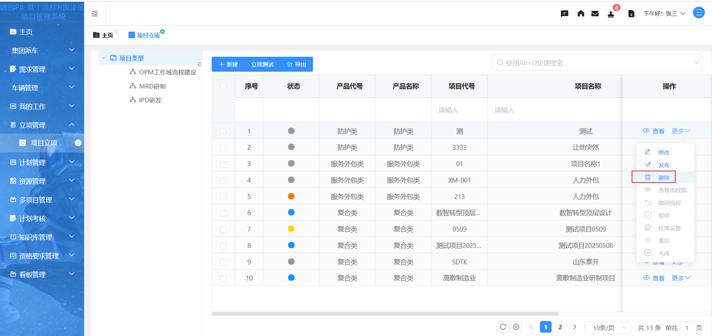

图 3.2.1.4-1

> 图 3.2.1.4-2

### 6.5项目发布

信息修改完成后，回到列表页面，将项目进行发布，点击发布按钮，弹出是否确认发布
提示，如下图所示:

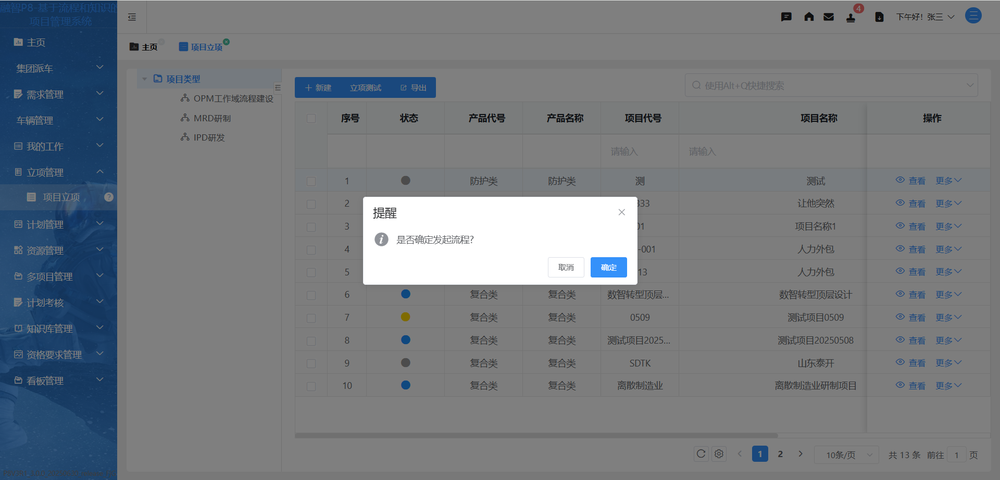

> 图 3.2.1.5-1

- 点击确定后，出现选择审批人弹窗，选择对应审批人后，可提交发布，审批提交后，
  登录对应审批人账号即可在我的审批中看到审批信息，审批人选择弹窗如下图所示:

> 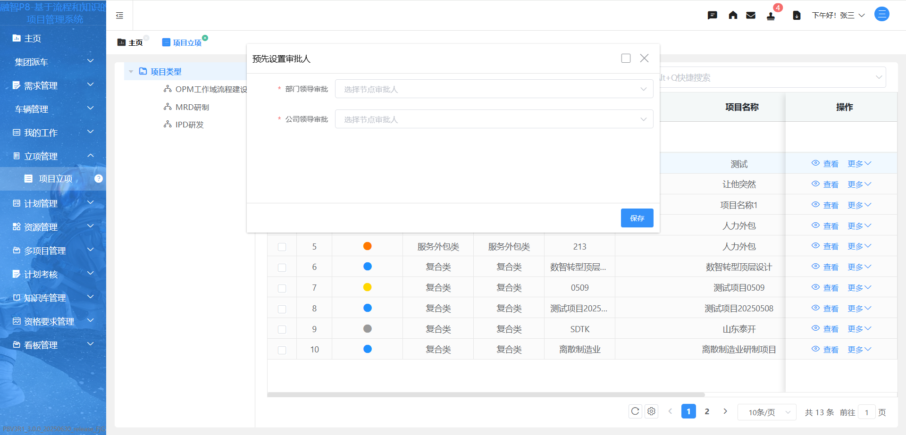
>
> 图 3.2.1.5-2

### 6.6查看流程图

> 发布提交后可查看审批流程图，可看到项目目前所在的审批节点，如下图所示:

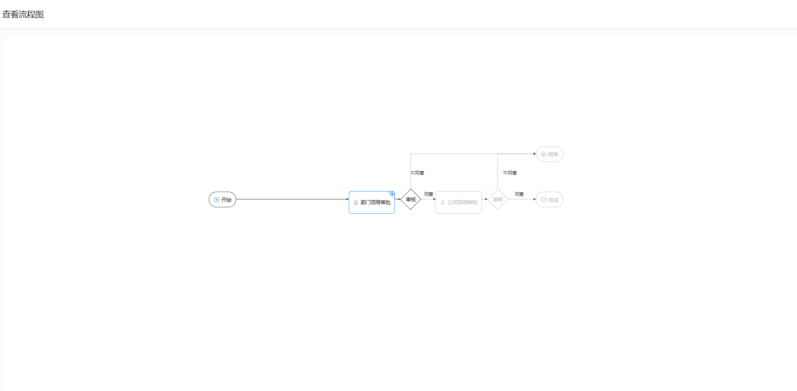

> 图 3.2.1.6-1

### 6.7撤回流程

> 项目发布审批后，还可撤回流程，点击按钮后弹出是否确认撤回弹窗，如下图所示:


> 图 3.2.1.7-1


> 图 3.2.1.7-2

- 流程撤回后项目状态变回已保存，可重新发布审批.

## 7计划管理

### 7.1计划管理列表

列表展示计划管理数据，并可进行新建，发布等操作，页面如下图所示:

> 
>
> 图 3.3.1.1-1

- 点击新建按钮，出现新建页面，填写完成基本信息后，点击保存，新建页面如下图所示:

  

> 图 3.3.1.1-2

- 点击锁定/解锁按钮，弹出弹窗，选择要锁定/解锁的字段并填入理由，弹窗如下图所示:

> 
>
> 图 3.3.1.1-3

- 选中已创建的数据后，协同编制按钮亮起，点击可将选中的数据协同编制按，数据状态变
  为协同编制按，如下图所示:

  

> 图 3.3.1.1-4

- 选中已创建的数据后，提交发布按钮亮起，点击可将选中的数据提交发布，点击按钮后，
  页面出现弹窗，可选择审批人，选择完成后可提交，如下图所示:

> 
>
> 图 3.3.1.1-5

- 点击导出按钮，将列表数据导出为 Excel

- 点击查看按钮，弹出查看详情页面，可查看计划详情，页面如下图所示:

  

> 图 3.3.1.1-6

- 点击更多按钮，展开功能列表:修改/删除/查看流程图

- 点击修改按钮，弹出修改页面，可修改计划数据，修改完成后点击保存，页面如下图所
  示:
> 
>
> 图 3.3.1.1-6

- 点击删除按钮，弹出是否确认删除弹窗，点击确认后可删除计划，弹窗如下图所示:

  

> 图 3.3.1.1-7

- 点击查看流程图按钮，查看该计划的审批流程或审批进度，如下图所示:

> 
>
> 图 3.3.1.1-8

- 列表状态标识以颜色及图标区分不同状态的数据，
  
  为已创建状态，可进行修改，删除，查看流程图操作;
  为统筹驳回状态，可进行修改，
  删除，查看流程图操作;
  为发布审批状态，不可操作;
  为发布驳回状态，可进行修改，删除，查看流程图操作;
  为完成审批状态，可查看流程图;

可进行修改，删除，查看流程图操作.列表目前显示的图标颜色及行状为默认状态，可自行根据需要更改

### 7.2计划概况

> 
>
> 图 3.3.1.2-1

- 计划概况页面为展示页面，将数据以图表形式展示出来

- 根据任务的完成情况等进行计算，并将结果以百分比形式展示在页面

### 7.3计划编制


> 图 3.3.1.3-1

- 第一个红框中为操作按钮，选中数据时，可操作的按钮会亮起，点击可进行对应操作

● 
为新建下级按钮，点击可为选中的任务新建下级，新建条数可选择 2/4/6/8
条或点击按钮直接新建一条，如下图所示:

> 
>
> 图 3.3.1.3-2
>
> ● 为新建同级按钮，点击可为选中的任务新建同级，新建条数可选择
>
> 2/4/6/8 条或点击按钮直接新建一条，如下图所示:
>
> 
>
> 图 3.3.1.3-3
>
> ● 为升级按钮，可将选中任务升级
>
> ● 为降级按钮，可将选中任务降级

- 
  为复制按钮，可将选中的任务及其子级进行复制，
  为粘贴按钮，可将复制的任务粘贴至列表中，任务层级与复制前一致(注:如粘贴之前选中了其他任务，复制时任务
  层级将与选中任务一致)

- 点击重做选中的任务

- 点击撤销选中任务的操作

> ●
> 为批量设置责任人，多选任务后点击此按钮，弹出人员选择框，可为选中的多个任
> 务同时设置责任人，如下图所示:
>
> 图 3.3.1.3-4
>
> ● 为删除按钮，可删除选中的任务，已下发，变更中，统筹中等正在进行操作的任务
> 不可删除
>
> ● 为详细信息按钮，点击可查看选中任务的详细信息，如下图所示:
>
> 
>
> 图 3.3.1.3-5
>
> ● 为里程碑标识，点击可为选中任务添加标识;
> 为监控点标识，点击可为选中任务添加标识;
> 为取消标识格式刷，点击可取消标识
>
> 为取消任务类型标识，点击可为任务取消已选择的任务类型
> 为设计工艺图标，点击可为选中任务添加任务类型;
> 为生产试制标识，点击可为选中任务添加任务类型;
> 
>
> ● 点击可修改任务名称颜色;
> 点击可为任务名称字体加粗/倾斜/增加下划线;
> 点击可取消字体样式
>
> ● 点击将选中任务下发给对应的负责人，下发前提示是否确认下发，如下图所示:


> 图 3.3.1.3-6

- 为通知下发按钮，可下发通知，点击弹出弹框，填写通知范围及内容后进行下发，
  如下图所示:

> 
>
> 图 3.3.1.3-7

-  为Excel 导入导出按钮，点击可导入本地数据或导出列表数据; 为 Project
  导入导出按钮，点击可导入本地数据或导出列表数据

> ● 为知识库导入按钮，点击侧拉出活动导入页面，可将本地活动导入至计划编制列表
> 中，如下图所示:
>
> 
>
> 图 3.3.1.3-7
>
> ● 为我的经验库，点击弹出弹窗，可查看经验库数据，如下图所示:
>
> 
>
> 图 3.3.1.3-8
>
> ● 为查询按钮，点击弹窗查询弹窗，可对列表数据进行搜索，如下图所示:


> 图 3.3.1.3-9

- 为变更历史按钮，点击侧滑出选择任务的变更历史信息页面，如下图所示:

> 
>
> 图 3.3.1.3-10
>
> ● 点击统计按钮，弹出统计页面弹窗，如下图所示:


> 图 3.3.1.3-11
>
> ● 点击创建版本，弹出版本创建弹窗，点击确认后，再次弹出弹窗确认是否创建版本，
> 如下图所示:
>
> 
>
> 图 3.3.1.3-12
>
> 图 3.3.1.3-13
>
> ● 点击版本列表，侧滑出版本对比页面，如下图所示:


> 图 3.3.1.3-14

- 点击对比按钮，跳转至版本对比页面，可对比两个版本之间的差异，如下图所示:


> 图 3.3.1.3-15

- 为资源视图按钮，点击可查看资源视图，如下图所示:


> 图 3.3.1.3-16

- 点击可查看 gantt 图，如下图所示:

> 
>
> 图 3.3.1.3-17

- 查看甘特图及资源视图时，点击此按钮可回到计划编制列表页面

> ● 查看甘特图及资源视图时，点击此按钮可将图中的关键路径标为红色，如下图所示:


> 图 3.3.1.3-18
>
> ● 点击可将页面全屏展示，再次点击退出全屏
>
> ● 为列设置按钮，点击弹出弹窗，可对列表表头进行设置，如下图所示:
>
> 
>
> 图 3.3.1.3-19
>
> ●
> 为设置按钮，点击弹出弹窗，可对计划编制页面的图标，排程方式等进行设置，
> 如下图所示:
>
> 图 3.3.1.3-20

- 进入计划编制页面时，提示同时编辑在线人员人数及详情，如下图所示:

> 
>
> 图 3.3.1.3-21
>
> ● 为警告提示，如当前任务时间查出预期时间，会在任务名称处出现此图标，点击可
> 悬浮出提示，悬浮提示内容如下图所示:
>
> 
>
> 图 3.3.1.3-22

- 列表状态标识以颜色区分不同状态的数据，为待下发，可进行下发，变更，新建下级等操作; 为已下发状态， 不可操作;

为变更中状态，可在计划变更页面进行查看，不可进行操作;
为提交审批状态，审批提交后不可进行操作;
为审批驳回状态，可重新发起审批;为审批完成状态，不可进行操作.列表目前显示的图标颜色及行状为默认状态，可自行根据需要更改

- 排程类型:列表新建的数据，排程类型与父级数据一致，知识库导入的数据默认为自动，
  知识库数据可在产出流程管理中进行添加

- 前后置有两种添加方式，在列表中进行添加或是在甘特途中进行添加，如下图所示:


> 图 3.3.1.3-23

- 方式 1：如图 2.8.1-4
  所示，在需要添加前置的任务的"前置"下双击，输入前置任务的序号，即可成功添加前置。如需添加多个前置任务，用";"分割即可。

- 方式 2：如图 2.8.1-4
  所示，在计划图表处点击需要添加后置的任务末端的小圆圈，连接至其后置任务上即可。

### 7.4计划监控

计划监控页面与计划编制页面一致，如下图所示:

> 
>
> 图 3.3.1.4-1

### 7.5计划变更

计划变更页面可以对任务的名称，时间，标识等信息进行变更，如下图所示:


> 图 3.3.1.5-1

- 点击发起变更，可选择与本任务同属一条计划的任务进行变更，变更只能选择已下发的数据，变更完成后点击保存，保存后点击提交，可进行变更审批，审批中时数
  据状态为变更中

- 发起变更时会跳转至计划编制页面，可选择任务进行变更，并对任务内容进行更改，如
  下图所示:

> 
>
> 图 3.3.1.5-2

- 修改内容保存后，点击保存，数据保存后可提交审批，提交审批页面如下图所示:


> 图 3.3.1.5-3

### 7.6计划预警

> 计划预警页面用于展示预警数据，页面如下图所示:
>
> 
>
> 图 3.3.1.6-1

- 点击新建按钮可新建预警，新建页面如下图所示:


> 图 3.3.1.6-2

## 8计划考核

### 8.1计划考核列表


> 列表查询：

新建：点击新建按钮，弹出如图下图所示内容;

> 开始考核：点击开始考核，月度考核状态变为考核中


> 
>
> 

删除：点击删除按钮，物理删除月度计划考核。

列表中的评价根据计划完成率进行展示，

展示规则为:

优: 计划完成率\>=95

良：95\>完成率\>=85

差：计划完成率\<85

## 9资源管理

### 9.1团队管理列表

列表展示所有项目数据，点击勾选数据后即可进行操作，页面如下图所示:


> 图 3.4.1.1-1

- 点击查看按钮，查看团队成员以及项目信息，如下图所示:


> 图 3.4.1.1-2

### 9.2团队管理

> 勾选数据后，团队管理按钮亮起，点击管理项目团队成员，页面如下图所示:


> 图 3.4.1.2-1

- 勾选一条数据后，点击团队管理按钮进入此页面

- 点击上传附件，可添加人员命名文件等

- 点击新建角色类别，添加新角色，角色类别为必填项，新建后必须添加成员，成员数不

> 可为 0

- 中间人员列表由左边角色类别控制，点击角色类别显示其中的成员，点击添加成员按钮，
  出现人员选择弹窗，可添加新成员，一个人员可以在不同角色中重复添加，人员选择弹窗如下图所示:

> 
>
> 图 3.4.1.2-2

- 点击右下方载入标准团队，可将标准团队导入到列表中，将其中的角色类别在列表进行
  展示，标准团队数据在 2.11.3
  标准团队管理中进行创建，载入标准团队页面如下图所示:

> 
> 图 3.4.1.2-3

- 点击保存按钮，保存修改后的数据

### 9.3替换责任人

勾选数据后，替换责任人按钮亮起，点击进入替换责任人页面，页面如下图所示:


> 图 3.4.1.3-1

- 勾选数据后，点击替换责任人按钮，可进入此页面

- 点击被替换人，弹出人员弹窗，选择人员后，展示在选择框中，人员只支持单选，页面
  如下图所示:

图 3.4.1.3-2

- 选择任务类型，可选择移交的任务是全部移交还是只移交状态为未完成的任务

## 10多项目管理

### 10.1任务统计查询


> 图 3.5.1-1

- 展示当前登陆人所有的计划任务统计

### 10.2计划完成率

#### 10.2.1项目计划完成率

项目计划完成率列表展示项目中计划的完成率，还可以将列表数据导出，以及进入钻取
页面查看计划中的任务数据，项目计划完成率页面如下图所示:

> 
>
> 图 3.5.2.1-1

- 点击导出按钮，导出列表数据

- 点击页面带横线的数据，可进入钻取页面，查看数据详情，钻取页面如下图所示:


> 图 3.5.2.1-2

#### 10.2.2部门计划完成率

部门计划完成率列表展示每个部门中计划的完成率，还可以将列表数据导出，以及进入
钻取页面查看计划中的任务数据，部门计划完成率页面如下图所示:

> 
>
> 图 3.5.2.2-1

- 点击导出按钮，导出列表数据

- 点击页面带横线的数据，可进入钻取页面，查看数据详情，钻取页面如下图所示:


> 图 3.5.2.2-2

## 11知识库管理

### 11.1基础数据管理

#### 11.1.1其他数据

基础数据管理分为两个 tab
页展示，分别为其他数据和项目类型，其他数据页面如下图所示:


> 图 3.6.1.1-1

- 点击新建按钮，对列表数据进行新建，新建页面如下图所示：

  

> 图 3.6.1.1-2

- 点击修改按钮，弹出修改页面，可对数据进行修改，页面如下图所示:

- 点击删除按钮，删除列表数据，删除前弹出是否确认删除提示，点击确定，删除列表数据

#### 11.2项目类型

项目类型列表如下图所示:


> 图 3.6.1.2-1

- 点击新建按钮，对列表数据进行新建，新建页面如下图所示：

  

> 图 3.6.1.2-2

- 点击修改按钮，对列表数据进行修改，修改页面如下图所示:

> 
>
> 图 3.6.1.2-3

- 点击更多按钮，展开功能列表:删除/启用

- 点击删除按钮，删除列表数据，删除前弹出是否确认删除提示，点击确定，删除列表数
  据，弹窗如下图所示:


> 图 3.6.1.2-4

- 点击停用按钮，停用选中的项目类型

- 点击启用按钮，启用选中的项目类型

### 11.2产品信息管理

产品信息管理页面为基础数据的一种，可在项目立项时使用，页面如下图所示:

> 
>
> 图 3.6.2-1

- 点击新建按钮，对列表数据进行新建，新建页面如下图所示：

  

> 图 3.6.2-2

- 点击修改按钮，对列表数据进行修改，修改页面如下图所示:

> 
>
> 图 3.6.2-3

- 点击更多按钮，展开功能列表:删除/查看

- 点击删除按钮，删除列表数据，删除前弹出是否确认删除提示，点击确定，删除列表数
  据，弹窗页面如下图所示:

  

> 图 3.6.2-4

- 点击查看按钮，查看产品信息详情，详情页面如下图所示

  

> 图 3.6.2-5

### 11.3标准团队管理

- 标准团队管理列表用来展示标准团队及默认团队，页面如下图所示:

  

> 图 3.6.3-1

- 点击新建按钮，新建标准团队数据，新建页面如下图所示：

  

> 图 3.6.3-2

- 点击修改按钮，对列表数据进行修改，修改页面如下图所示:

  

> 图 3.6.3-3

- 点击更多按钮，展开功能列表:删除/查看/团队设置

- 点击删除按钮，删除列表数据，删除前弹出是否确认删除提示，点击确定，删除列表数
  据，弹窗页面如下图所示:

  

> 图 3.6.3-4

- 点击查看按钮，查看团队信息详情，详情页面如下图所示：

  

> 图 3.6.3-5

- 点击团队设置按钮，对角色信息进行编辑，如下图所示:


> 图 3.6.3-6

- 点击新建角色类别按钮，填写类别信息及类别描述，点击保存按钮，可新建角色类别

- 在新建角色类别时，也可新建角色信息，角色为角色类别的下级数据，新建角色信息，
  将图上字段填写完整，点击保存后添加角色成功

### 11.4产出流程管理

#### 11.4.1产出流程管理列表

> 产出流程管理列表展示产出流程数据，并可进行新建修改等操作，页面如下图所示:


> 图 3.6.4.1-1

#### 11.4.2产出流程管理新建

> 点击新建按钮，新建列表数据，新建页面如下图所示：


> 图 3.6.4.2-1

- 点击更多按钮，展开功能列表:删除/修改/复制

- 点击复制按钮，将选中数据复制一份在列表上

#### 11.4.3产出流程管理修改删除

> 点击修改按钮，修改列表数据，修改页面如下图所示:


> 图 3.6.4.3-1

- 点击删除按钮，删除列表数据，删除时提示是否确认删除，点击确认后删除列表数据，
  删除提示如下图所示:

  

> 图 3.6.4.3-2

#### 11.4.4活动管理

点击活动管理按钮，进入活动管理页面，对活动进行编辑活动管理页面分为两个
tab 页，默认模式及图形模式，默认模式如下图所示:

> 
>
> 图 3.6.4.4-1

- 点击列表活动管理按钮进入此页面

> ● 按钮为新建子活动，可为选中的数据新建子级
>
> ● 
> 按钮为新建同级活动，可谓选中的数据新建同级
>
> ●
> 按钮为复制按钮，选中列表数据后，点击按钮，可将选中数据进行复制

- 按钮为粘贴按钮，复制数据后，点击粘贴按钮，可将数据粘贴在列表，复制数据

> 时，可将数据子级一同复制
>
> ● 按钮为升级按钮，选中数据后，点击按钮可将数据升级，例如选中数据原本为三级
> 数据，可将数据升级为二级
>
> ● 
> 按钮为降级按钮，选中数据后，点击按钮可将数据降级，例如选中数据原本为三
> 级数据，可将数据降级为四级
>
> ● 按钮为删除按钮，点击可删除选中的数据
>
> ● 按钮为标识按钮，点击可谓列表数据添加标识，每条数据只能添加一个
> 标识
>
> ● 按钮为取消标识按钮，选中有标识的数据，点击此按钮可取消标识
>
> ●
> 为 Excel导入按钮，点击弹出页面，可下载模板后，进行数据导入，如下图所示:
>
> 图 3.6.4.4-2
>
> ● 为 Excel导出按钮，点击可将列表数据导出为 Excel 文件

- 默认模式页面的右侧为填写信息区域，点击左侧的活动，可填写活动描述，填写完成后
  点击保存，页面如下图所示

> 
>
> 图 3.6.4.4-3

- 点击左边列表数据，展示数据详情

- 数据填写完成后，点击保存，可将数据保存至左边列表中

- 前置数据不可选择父级和自己

- 默认模式-输入，页面如下图所示:


> 图 3.6.4.4-4

- 点击左边列表后，再次点击输入，展示输入页面

- 输入要求为文本框，可填写文字

- 上传附件按钮，点击后出现弹框，可选择需要上传的文件，选择完成后点击保存按钮，
  可保存修改后的数据，上传附件弹窗如下图所示:

> 
>
> 图 3.6.4.4-5

- 默认模式-输出，页面如下图所示:


> 图 3.6.4.4-6

- 点击左边列表后，再次点击输出，展示输出页面

- 输入要求为文本框，可填写文字

- 上传附件按钮，点击后出现弹框，可选择需要上传的文件，选择完成后点击保存按钮，
  可保存修改后的数据，上传附件页面如下图所示:

> 
>
> 图 3.6.4.4-7

- 默认模式-添加说明，页面如下图所示:


> 图 3.6.4.4-8

- 点击左边列表后，再次点击特别说明，展示特别说明页面

- 输入要求为文本框，可填写文字

- 上传附件按钮，点击后出现弹框，可选择需要上传的文件，选择完成后点击保存按钮，
  可保存修改后的数据，上传附件页面如下图所示:

> 
>
> 图 3.6.4.4-9

- 点击添加按钮，出现输入框和附件按钮，特别说明可多次添加

- 图形模式页面是将默认模式中的活动以图像形式展示出来，并可对活动进行新建修改等
  活动，页面如下图所示:

> 图 3.6.4.4-10

- 点击列表活动管理按钮进入此页面

- 页面展示内容为将默认模式列表中的数据按照层级进行图形展示

> ● 为新建活动，选中一个活动后，点击按钮，可在此活动下新建活动，或在页面直接
> 新建活动
>
> ● 为分解连接线，可将两个活动的连接线进行分解

- 前后置连接线，可将两个活动进行连接

> ● 为删除按钮，可删除选中的活动
>
> ● 为活动信息设置，点击出现活动描述，输入输出等编辑页面，如下图所示:


> 图 3.6.4.4-11
>
> ● 为居中显示，可将页面中的活动进行居中
>
> ●
> 为适应屏幕，如手动放大或缩小了图形，点击后可将图形恢复到初始状态

- 为放大缩小按钮，点击可将图形放大或缩小

## 12任职资格要求管理

### 12.1资格要求管理

任职资格管理下的资格要求菜单，点击对应菜单，展示任职资格相关的数据，列表界面如上

头部工具栏的导入模板下载点击后可下载对应的导入参考Excel模板，结合右侧导入Excel、导出Excel按钮

可支持Excel导入导出维护

点击新建界面如下：


新建时候表单对资格要求字段做了唯一性校验，库里已存在则不允许重复提交。

修改界面如下：


修改时候表单对资格要求字段做了唯一性校验，库里已存在则不允许重复提交。

可单独对某项任职资格要求进行删除操作。

### 12.2 等级资格要求管理

任职资格管理菜单下的等级任职资格管理菜单，点击对应菜单，展示等级对应的多个任职资格的列表数据

界面如下:


其中如果某个等级下有多项任职资格要求，以英文;号分隔

新增界面如下:


下拉带出系统数据字典里维护的等级分类下的所有等级选项，选择要维护的等级，点击新建条件可同时配

置多条任职资格要求，输入框可根据任职资格弹出选择框选择具体任职资格要求，表单提交时当前表单任

职资格不能重复。且提交时调用后端校验接口校验当前表单里角色与任职资格数据与库里是否重复，如重

复则给出提示不允许提交。

修改界面如下:


修改时，当前表单任职资格不能重复,也可删除等级任职资格信息。

### 12.3角色等级管理

任职资格管理菜单下角色等级管理菜单，点击对应菜单，展示角色所对应的多个等级的列表数据。

列表界面如下


新增界面如下:


下拉带出系统里配置的所有角色，选择要维护的角色，点击新建条件可同时配置多条等级，输入框可下拉

选择带出系统字典里配置的所有等级，表单提交时当前表单中等级不能重复，且提交需调用后端校验接口

校验当前表单里角色与等级数据与库里是否重复，如重复则给出提示不允许提交。

修改界面如下:


修改时，当前表单等级不能重复,也可删除角色等级信息。

### 12.4人员角色等级管理

任职资格管理菜单下人员角色等级管理菜单，点击对应菜单，列表展示用户所对应的多个角色以及这些角

色对应的等级数据。

列表界面如:


左侧采用部门树形导航栏和右侧表格布局，点击左侧不同部门可过滤出右侧表格对应部门数据。

新增界面如下:


可根据弹出选择框选择人员

确定后，回填人员对应的部门

点新建可配置人员的多个角色以及对应的角色等级，角色下拉带出系统里配置的所有角色，选择要维护的

角色后点击等级选项，可带出角色等级配置里配置的该角色所对应的所有等级，表单提交时当前表单角色

不能重复，且提交时需调用后端校验接口校验当前表单人员角色数据与库里是否重复，如重复则给出提示

不允许提交

修改界面如下:


修改时，当前表单角色不能重复，也可删除角色等级信息。

### 12.5人员画像模块


最上面区域展示员工基本信息(姓名、性别、年龄、部门等,下发展示员工的多个角色)

下面区域总共分为四宫格：

左上区域以饼状图的形式按项目类别统计人员历史承担任务个数及其占比；

右上区域采用雷达图展示员工当前岗位胜任力（具体展示任职资格要求、员工得分，注意事项：该区域的左上角对应员工当前角色与等级，雷达图展示当前角色等级下的多项任职资格要求,如员工拥有多个角色，则左上角以选项卡的形式展示。选择对应角色，角色任职资格随之动态变化，且页面初始化默认展示最左侧选项卡角色对应的等级和任职资格要求）

左下区域以饼状图的形式按任务类别统计人员历史承担任务个数及其占比；

右下区域以饼状图的形式按任务标识统计人员历史承担任务个数及其占比；

## 13看板管理

### 13.1部门计划完成情况


> 图 3.11.1-1

- 点击右上角第一个图标可放大看板进行查看，放大页面如下图所示:


> 图 3.11.1-2

- 点击右上角第二个图标可刷新看板页面

- 点击下方列表带横线的数据，可进入钻取页面，查看数据详情，钻取页面如下图所示:


> 图 3.11.1-3

### 13.2项目计划考核情况


> 图 3.11.1-4

- 点击下方列表带横线的数据，可进入钻取页面，查看数据详情，钻取页面如下图所示：

> 
>
> 图 3.11.1-5

### 13.3项目人员考核情况


> 图 3.11.1-6

- 点击下方列表带横线的数据，可进入钻取页面，查看数据详情，钻取页面如下图所示：

> 
>
> 图 3.11.1-7

## 14功能设置

### 14.1 外部链接配置与显示

登录实施人员账号(setup
密码:1)，进入外部链接配置与显示页面，可以添加外部链接，如下图所示：

点击新建，可创建外部链接信息，如下图所示

点击保存即可在对应角色的系统页头显示，点击可跳转

### 14.2 任务属性设置

登录实施人员账号(setup 密码:1)，进入任务属性设置页面，可对任务属性进行设置， 如下图所示:


> 图 3.8.1.1-1

- 点击新建按钮，新建任务属性，如下图所示:

> 
>
> 图 3.8.1.1-2

- 点击属性拓展页面，可新建任务属性，如字段，文本等，如下图所示:

  

> 图 3.8.1.1-3

- 点击修改按钮，可对任务属性进行修改，如下图所示:

> 
>
> 图 3.8.1.1-4

- 点击删除按钮，可删除任务属性信息，删除前出现确认是否删除弹窗，如下图所示:

  

> 图 3.8.1.1-5

### 14.3 任务标识管理

> 任务标识管理页面，可谓计划编制的任务添加或删除标识，页面如下图所示:
>
> 
>
> 图 3.8.1.1-1

- 点击新建按钮，弹出新建页面，填写表单数据后，点击保存按钮即可保存任务标识，如
  下图所示:


> 图 3.8.1.1-2

- 点击修改按钮弹出修改页面，可对任务标识的数据进行修改，如下图所示:

> 
>
> 图 3.8.1.1-3

- 点击更多按钮，下拉出操作按钮，点击停用，可停用当前任务标识，停用前弹出弹窗，
  确认是否停用，如下图所示:

  

> 图 3.8.1.1-4
>
> 
>
> 图 3.8.1.1-5

- 点击启用按钮，即可启用该任务标识，启用前弹出是否确认启用提示，标识停用后，启
  用及删除标识才能亮起，如任务在启用中时，任务不可进行启用及删除操作，如下图所
  示:


> 图 3.8.1.1-6
>
> 
>
> 图 3.8.1.1-7

> 图 3.8.1.1-8

点击删除按钮，删除任务标识，删除前弹出是否确认删除提示，如下图所示:


> 图 3.8.1.1-9

### 14.4任务类型操作设置

> 点击进入任务类型操作页面，如下图所示:


> 图 3.8.1.3-1

- 点击设置，弹出任务类型操作设置页面，如下图所示:

  

> 图 3.8.1.3-2

### 14.5其他全局设置

点击其他全局设置，如下图所示


排程设置：可设置计划默认排程是手动还是自动

按钮展示模式：设置计划编制顶部菜单样式

任务实际完成时间填写限制设置：任务完成时完成时间可设置自动带入系统时间，也可设置为手动选择

父任务完成方式：可设置所有子任务都完成时，父任务自动提交完成审批，或者手动提交

提前/超期完成标志：提交完成审批：责任人在任务执行中，发起提交完成审批时(任务状态)，
完成审批通过：任务完成审批通过后，判定为已完成。

提前/超期展示类型：提前/超期xx天完成：完整展示(当前默认逻辑)-/+xx天完成：-代表剩余/提前，+代表超期。

右键功能区：设置编辑页面右键的功能

### 14.6 默认计划预警设置


可新建计划预警，点击同步可在计划中的预警列表中生效

### 14.7 系统备份设置

点击系统备份管理，如下图所示：


点击右上角备份可将当前数据库备份到指定文件夹中，备份成功后如需恢复数据，可找到备份的地址名称，点击恢复，等待系统重启，可恢复到指定的数据环境中。

### 14.8流程模板

实施人员登录系统进入业务流程管理-流程模版页面，列表展示的数据为已创建的流程模板：


点击新建弹出新建流程表单页面，填写之后点击保存即可保存成功(流程名称和流程key不可重复)：


点击部署本地流程弹出抽屉，点击上传附件选择系统中的流程文件，点击上传，即可部署成功，若选择流程文件的key已存在则会替换已存在流程文件，若key不存在则会新增一条记录：


点击编辑流程模版按钮即可进入流程图编辑界面，编辑器上方为按钮区，左侧为工具栏，右侧为属性编辑栏：


上方为按钮分别为：

打开文件：打开bpmn文件进行编辑；

下载文件：将编辑好的流程文件保存为XML、SVG、BPMN文件；

编辑器上方图标分别为：左对齐、右对齐、上对齐、下对齐、水平居中、垂

直居中、缩小、放大、自适应、撤销、恢复、重绘；

左侧分别为：

抓手工具：点击后可以拖动节点的位置；

激活套索工具：点击后可以多选节点并进行拖拽；

激活全局连接工具：点击后可以连接各节点；

创建开始事件：点击后生成开始节点一个流程图只能有一个开始事件，点击创建的开始节点右侧会弹出表单编辑页，常规里的ID是唯一的，名称为节点名称执行监听器是用来在流程发起时捕获开始事件的监听，事件类型选择选择start，监听器类型主要用Java类和代理表达式，选择Java类时需实现JavaDelegate类，选择代理表达式时，代理表达式需实现ExecutionListener接口，重写他们的方法去实现具体的业务逻辑，添加的字段是具体业务逻辑中需要操作的字段。扩展属性根据实际业务逻辑添加方法中通过execution.getVariable(\"扩展字段\")获取；

创建网关：后生成网关，用于控制流程中的分支和合并，帮助定义在特定条件下流程的走向，网关后通常为同意和不同意两条分支，点击分连接线右侧弹出表单，流转类型分别为普通流转路径、默认流转路径、条件流转路径，连接线通常为普通流转路径，网关后一般选择条件流转路径，条件格式为表达式，表达式通过yesOrNo.isApproved()方法获取审批结果，true为同意，false为驳回，通关判断的结果来决定流程走哪条分支，执行监听器和扩展属性与开始事件保持一致

创建结束事件：点击后生成结束节点，一个流程图可以有多个结束事件，点击创建的结束节点右侧会弹出表单编辑页，执行监听器是用来在流程发起时捕获结束事件的监听，事件类型选择选择end，其他与开始事件保持一致；


创建用户任务：点击生成用户任务，点击用户任务右侧弹出表单页面，其中常规为节点名称和ID，表单为下拉选择，选择审批时需要展示的表单页面，选择完表单后输入里会自动新增formSelector属性，任务模块里处理用户为选择审批人时给后端传递的变量名，候选用户和候选分组是组合条件用来过滤审批时审批人的条件，用户选择器默认为团队选择器和部门选择器，任务监听器监听任务事件的变动去执行，执行监听器与扩展属性与开始事件保持一致；


流程模板配置完成后，当菜单权限按钮里的事件和表格按钮里的按钮事件选择为startProcess时，点击设置按钮参数，弹出设置事件参数表单页面，业务流程定义为下拉选择，选择已配置的流程图即可将业务与流程图关联


当业务中点击上述按钮时即可发起审批，选择节点对应的审批人点击保存后即可成功发起审批。

### 14.9 流程实例管理

实施人员登录系统进入业务流程管理-流程实例管理页面，左侧列表展示的数据为审批中的流程，右侧为审批详情；


点击修改弹出选择人员页面，勾选后填写之后点确定，即可成功修改审批人，该条审批的原审批人将不会再收到该审批消息，审批消息将会发送给目标


点击终止弹出确认框，点击是后，该流程将会终止


## 15 组件管理

### 15.1.基础

该功能主要用来维护低代码表单中所使用的基础组件内容，页面表格支持搜索和配置


点击新建或修改页面：


组件名称为该基础组件功能的简单中文描述

组件标识为该基础组件功能的简单英文名称

停、启用状态，选择该项可以控制该组件是否可用

组件类型分为布局型组件、选择型组件、输入型组件。一般根据该组件的功能来选择类别

icon用来展示组件

jsonData为组件渲染所定义的json串，有特定的格式要求

### 15.2表单

点击表单可打开表单管理页面：


点击新建修改页面：


1.表单编码要求全局唯一，并且为英文，使用语义化命名

2.表单名称和表单描述是对该项表单的一个中文说明

3.表单发布状态，未发布的表单不能提供给其他功能正常使用，例如表格，图表，布局等。所以在表单编辑完成确认无误后一定要发布表单

点击主页表单设计按钮后，会进入表单设计器页面：


页面整体为左中右布局

左边为可以使用的组件，数据来源为组件管理-基础（基础组件启用后才可正常使用）

中间为上下布局，上边为功能按钮，[结构树](tree)、[保存](save)。下边为表单设计器的渲染右侧分为两个部分，
组件属性和[表单属性](form)。表单属性是设置整个form表单属性的，组件属性是设置每个组件通用属性和私有属性的地方。每个组件都有其独特的属性，组件之间也可以有机的组合，eg.在布局组件中添加输入组件或选择型组件。

在组件待选区域，直接点击组件即可添加，或者单机选中后按住鼠标不松手并拖动，即可将组件放置到想要的区域：


整体结构树是为了更加清晰明了的展示整个表单设计的层次结构，并且结构树支持点击选中组件，单击后拖动排序的功能：


完成表格的配置项后，即可点击保存配置，之后选择发布表单后，就能正常使用该表单：

注意事项:
表单设计器下方的提交、保存、取消、重置等按钮为表单渲染时按钮的体现，不是表单配置的保存按钮。

表单设计区域回显了基础组件的展示形式，并且点击选中后可以设置组件的私有属性，或者点选后不松开鼠标可以上下拖动排序（当前选中的组件会有个淡色背景），选中后还可在右上角操作复制和删除：


表单属性界面：


表单名、表单模型、校验模型为表单的固有属性，不可更改

数据源选择是表单保存数据会存放的表

表单尺寸的切换，会影响组件的大小

标签对齐分为左、右、顶部对齐

标签宽度：在标签文字过长的时候调整标签宽度，可以使文字在一行内展示

栅格间隔一般用作一行内有多个组件时，组件间的间隔距离

禁用表单，开启后表单内的元素都无法输入

表单按钮，关闭表单按钮后，将无法显示提交，重置等保存按钮

添加按钮： 表单支持自定义按钮，如若不配置则默认显示提交按钮

表单按钮自定义分为四种，提交、重置、取消、自定义。点击选中选项后，按钮会出现在设计器的下方：


点击按钮右上方的图标可以删除按钮，点击按钮选中不松开鼠标，可以拖动排序按钮的位置。点击按钮即可选中按钮，选中的按钮周边有虚线的边框，在右侧表单属性中可以设置选中按钮的文字显示和按钮类型，选择的按钮类型不同，显示的颜色也不同：


其中，选择自定义按钮后，会有一个单独的配置，即编写该自定义按钮点击后触发的事件行为函数。编写函数时，默认有函数名，直接编写内容即可。函数传递的formData参数为表单的数据，有固定的数据格式：


显示未选中边框：打开后组件周围出现虚线边框，为了更好的区分各个组件：


表单开启表单关闭提示后，在弹框组件，抽屉组件的右上角点击X关闭时会触发关闭提示框,并触发回调事件formClose()：


组件属性界面：


数据源字段：指该表单元素值存储的数据库表的字段，应当唯一，不可重复

数据源字段下拉数据由字段名称+字段+字段长度组成，选择字段后则会自动回填到数据源字段、标题、占位提示。

变量：使用系统变量或计算公式或系统方法，点击后方按钮，进入详情，一般都已\$开始

标题：该项可设置表单元素左侧的label文字

占位提示：该项可设置表单组件值为空时默认展示的提示文字

表单栅格：该项可设置表单组件的默认宽度，默认宽度铺满全屏。可通过该项设置值的滚动条手动选择宽度

标签宽度：当标题设置字数过多，文字一行可能展示不下，这时可以修改标签宽度使文字一行展示

默认值：输入型组件或选择型组件在表单初始化时默认存在的值（非空）

显示标签：该项的启停，可以控制左侧label文字的显示与隐藏

标签提示：当简短的文字不足以描述当前表单组件功能时，可以使用标签提示进行补充说明

是否隐藏：该项设置控制表单组件在渲染时是否暂时，一般用作设置默认值，且不需改变的情况

能否清空：设置该项后，当组件有值，在后方会显示可清空的图标按钮，点击即可清空当前组件值

是否只读：设置只读后，不能修改值

是否禁用：设置禁用后，不能修改值，且鼠标形状改为禁止形状

是否必填：该项是表单校验的一部分，如若开启必填，则必须有值，不然不能保存

正则校验：该项是表单校验的拓展，在基础校验不满足的情况下，可以使用正则表达式对值过滤，可以添加多条正则校验。eg.只可输入数字/只能输入邮箱等

函数校验：该项是表单校验的拓展，提供更加强大且灵活的校验方式。通过自定义的函数内容对表单值进行判断是否满足

事件属性：用来设置当前组件的触发事件，目前支持change事件，后期可拓展

输入统计：搭配最多输入字符，可以显示当前输入多少字，共可输入多少字

联动显示
：开启联动显示后，选择联动字段，联动的字段选择了数据之后会自动把对应的值回填到单行文本组件

### 15.3看板

点击看板可打开看板管理页面：


通过新建功能按钮将进入下图所示的界面。该界面分为：设计区域、添加图表功能按钮、属性设置区域


右上角点击加号弹出所有配置好的图表，选择已创建的图表组件，将其加入到看板设计器中，如下图所示：


图表添加后，可在看板设计区域对其进行配置，如下图所示，通过拖动标题栏可对看板位置和布局进行调整，通过缩放图标可对图表进行大小缩放，点击齿轮图标可进行删除或图表设置界面。图表设置界面可修改图表标题、颜色以及数字化调整大小。

配置后，可通过右下角的预览按钮进行实时预览，查看渲染后的结果，或点击保存按钮进行保存

删除操作将已有看板进行删除，如果在生产环境，请确认该看板是否需要删除，否则可能造成线上应用出错。删除看板不会删除已创建的图表组件，但所有布局样式等均无法恢复

### 15.4表格

点击表格可打开表格管理页面：


点击新建按钮弹出新建页面，可通过配置生成一个表格，配置页面如下图：


表格编码：表格的唯一标识，后面会通过编码区分不同的表格。

表格名称：是给配置好的表格起一个名字，方便查找

表格类型：列表为普通表格，树形为有父子级的表格

数据视图：表格配置明细的数据源，数据来源于数据源管理-数据视图，通过选择数据视图可自动带出表格配置明细的字段。

表格配置明细：新建按钮会增加一行数据：

字段名称：对应数据库所存的字段。

字段类型：对应数据库字段类型。

字段文本：对应字段的中文名称。

字段宽度：生成表格后表格头部的字段宽度。如果不设置，保存的时候会根据字段长度计算出字段宽度。

排序：字段的顺序。

表头对齐方式：表格头部名称的对齐方式，可选择左对齐、居中对齐、右对齐。

内容对齐方式：表格数据的对齐方式，可选择左对齐、居中对齐、右对齐。

列表是否显示：勾选后则会展示在生成的表格列表，不勾选默认不展示该字段。

查看是否显示：勾选后则会展示在查看页面，不勾选默认不展示该字段。

是否排序：勾选后在生成的表格上会多出一个排序标识，可以使用该字段进行排序，不勾选默认不排序。

表格合并列设置： 其中有两处配置，是否合并列和合并列条件

勾选是否合并列后，如果该列相邻的两个值相同则合并

勾选合并列条件后，只有在该列的相邻的两个值相同的情况下，才会去合并其他列，如果存在多个合并列条件，默认选用第一个


是否查询：勾选后该列可作为查询条件进行数据过滤，不勾选默认不作为查询项。勾选的字段会出现在查询配置里面，用户可进行查询配置


查询配置介绍：查询模式列

文本框：普通输入框。

数字：InputNumber 计数器。

目录组件：普通下拉框，需要在选项组件列选择下拉的数据，数据来源于组件管理-选项-目录类。

树组件：树形下拉框，需要在选项组件列选择下拉的数据，数据来源于组件管理-选项-树形类。

复选：checkbox复选框，需要在选项组件列选择下拉的数据，数据来源于组件管理-选项-目录类。

单选按钮：radio单选框，需要在选项组件列选择下拉的数据，数据来源于组件管理-选项-目录类。

自定义列配置介绍：

自定义列能够实现如序号列生成、预留插槽进行图标渲染等功能，可在自定义列配置选项页中管理。勾选后会出现在自定义列配置里面，用户可对该字段进行自定义配置，如下图：


在表格配置明细中勾选自定义列之后，排序、查看是否显示、是否查询、自定义类名、单击事件、单击事件页面名称会被禁用。

自定义列配置主要以自定义列类型展开配置，自定义列类型能够实现生成序号、生成图标、公式计算等功能，可在列设置中配置图标和计算的生成规则。

选择序号：如果表格类型是列表则会生成序号，如果是树形则生成大纲号。

选择计算：是否表位合计列开启，勾选后该字段则在表格中会进行合计。是否父节点合计列开启，如果是树形列表，勾选后该字段可在树形表格中对父节点进行合计。列设置字段开启，点击弹出设置计算公式页面。


点击保存则会生成公式并且回显在列设置文本框中。

选择图标：旁边的添加按钮可打开设置图标弹框


是否数据字典：选择是则使用数据字典的图标，否则可以自定义图标。

判断字段：用来和数据字典的数据做比对，如果存在则展示该图标。

选择数据字典：选择字典里的数据。

图标选择：点击打开图标选择器，可选择对应的图标。

判断值：当该值等于判断字段选择字段的值则显示图标。

悬浮显示：配置后手标放在图标上可展示配置的内容。

图标显示方式：可配置列表行数据上面的图标展示的方式。

编辑配置介绍：
启用编辑操作：禁用则不开启表格行内编辑功能，开启则启用行内编辑功能，同时增加编辑配置，可以在表格上对数据进行操作（新增首行、新增尾行、删除、保存等）。


编辑模式：择行编辑就是在表格上面可以修改数据，弹出编辑就是点击修改按钮弹出编辑表单进行修改。

保存模式：自动为失焦自动保存，手动则需要点击保存按钮进行保存。

存储数据源主表：选择数据要存储的数据库表。

是否必填：勾选则保存的时候会进行必填校验。

编辑是否隐藏：隐藏不需要展示的列。

默认值：点击默认值右侧问好，弹出默认值列表，复制参数key粘贴到默认值列，列表会默认展示参数key对应的参数值。

编辑组件类型：有文本框、数值、日期可选。

字段名：保存到数据库的字段名称。

查询条件位置为多选，表头查询和行内互斥，只能二选一。查询条件位置为多选，表头查询和行内互斥，只能二选一

表格按钮介绍：启用权限按钮：启用后默认使用菜单下的权限按钮，可在系统设置-功能设置-菜单下进行配置，禁用则可在表格按钮中配置需要的按钮。


新建按钮：可在下面表格新增一行数据进行配置。

按钮文本：按钮的名称。

图标：点击弹出图标组件，可选择按钮的图标。

位置：行内和顶部。

按钮事件定义，可使用平台内置事件，也可使用输入名称使用自定义事件
，自定义事件需嵌入渲染器二次开发实现，内置事件如下：

createForm表单新建操作：调用表单组件进行新建操作

modifyForm表单修改操作：调用表单组件进行修改操作

deleteForm表单删除操作：删除表格行内数据

viewForm表单查看操作：调用表单组件进行查看

openComponent弹出窗口打开组件：弹出已设置的组件

dynamicAPI接口调用：调用方法向配置的接口发起请求

startProcess发起流程：弹出弹框发起审批流程

viewProcess查看流程图：弹出流程图查看界面

cancelProcess撤回流程：撤回已发起的流程

addFirstRow新增首行：可编辑表格新增一行数据

addLastRow新增尾行：可编辑表格新增一行数据

saveEditData行编辑保存事件：可编辑表格保存事件

editRowEvent行编辑事件：打开行编辑进行修改

deleteRowEvent行删除事件：可编辑表格删除表格行内数据

openEditTable：编辑类型为弹出编辑时，该事件为打开弹框，可编辑子表，需选择已配置的编辑表格

customerFun：该事件为用户自定义事件执行

viewTableRow：查看表格行数据

exportExcel导出Excel：导出列表数据

参数配置介绍：

参数字段：查询传值的字段。

参数文本：具体的名称。

参数默认值：查询默认会传这个参数。系统内部封装了各个页面传递过来的参数，统一使用input_接收，默认值可使用上个组件传递过来的值。

使用方法：例P8Param.table.table-projectTypeTable.ID

P8Param（为系统默认参数头）+ table（表格的类型，表单则使用form等）+
table-projectTypeTable（表格类型和表格的code）+ ID（要获取的数据字段）

参数来源：报表参数，会默认把值传人列表reportParam参数中。

是否查询：勾选则使用该字段进行过滤。

删除：删除当前行。

功能测试：可以预览配置好的表格并进行操作

表格复制
点击复制按钮会生成一条一模一样的新数据，用户可直接在复制好的数据上进行改造。

### 15.5选项

选项组件是表单组件的辅助组件，其能支持表单组件中常用的单选框组、多选框组、下拉选择、树形选择或更复杂的弹出式表格选择。能够将数据库中现有数据构建成选择项，在表单组件配置和渲染时使用。选项组件按类别可以分为目录类、树形类、表格类。


#### 15.5.1目录类

目录类选项组件支持使用内置数据字典项和SQL数据视图数据来创建组件。

1.采用数据字典作为数据来源时，可选择已内置的数据字典项进行创建。

2.采用SQL数据视图作为数据来源时，需选择在数据源管理中已创建的数据视图记录。选择期望的SQL数据视图后，需指定选项显示文本和选项值分别对应的SQL数据视图中的相应数据列（字段）。

#### 15.5.2树形类

树形类选项组件支持使用内置数据字典项和SQL数据视图数据来创建组件。

1.采用数据字典作为数据来源时，可选择已内置的数据字典项进行创建。特别说明：此处选择的数据字典数据结构应该为包含父子关系的树形结构。

2.采用SQL数据视图作为数据来源时，需选择在数据源管理中已创建的数据视图记录。选择期望的SQL数据视图后，需指定选项显示文本和选项值分别对应的SQL数据视图中的相应数据列（字段）。


#### 15.5.3表格类

表格类选项组件用来实现在表单应用中复杂的选择场景，例如某些弹出选择时数据显示为多列的表格数据，选中后回填至表单页面。

表格类选项组件在创建时，需选择已保存的表格组件。


选择左侧选项类别，点击新建/修改弹出编辑页面


选项编码：选项组件的唯一标识，可使用编码调用该条数据。

选项名称：对应的名称。\

数据来源：数据字典，SQL数据视图，决定数据的来源。

数据字典：数据来源选择数据字典，可下拉选择数据字典的数据。

SQL数据视图：数据来源选择数据视图，可下拉选择数据视图的数据。

选项显示文本：选择下拉数据的label值，一般为NAME。

选项值：选择下拉数据的value值，一般为ID。

描述：对你新建的该条数据进行介绍。

点击保存存储在数据库表中。

### 15.6图表

图表组件主要应用于对数据进行可视化分析，采用如饼状图、柱状图、表格并结合数据下钻等技术，实现对业务数据的深层分析或辅助决策。其可以创建纯静态数据的图表演示功能来完成系统原型创建，也可以调用数据视图来实现真实业务场景的数据可视化应用。


注意事项：删除指定的图表组件，如在生产环境需注意，删除后会影响系统的应用。

新建页面：


组件名称：图表组件的中文名称\
\
图表渲染器：配置图表组件采用的渲染器类型，当前支持ECharts渲染器、自定义渲染器、表格渲染器、antv G2渲染器\
\
组件地址：图表渲染器为自定义渲染器时，需要配置自定义渲染器的页面地址\
\
默认宽度：图表组件渲染时的默认宽度，渲染方式为将屏幕等分为12列\
\
最小宽度：图表组件渲染时要求的最小宽度。\
\
默认高度：图表组件渲染时的默认高度，渲染方式为将屏幕等分为12行。\
\
最小高度：图表组件渲染时要求的最小高度。\
\
排序号：图表组件的排序号。\
\
是否终端用户可用：终端用户可用的组件，将在角色管理-设置应用中可分配给指定角色。\
\
自定义数据源：可以使用自定义的接口数据给图表使用\
\
数据视图数据源：动态数据来源，可选择已定义好的数据视图\
\
表格数据源：图表渲染器为表格渲染器时，可选择已经配置好的表格\
\
业务分类：按所属业务对图表组件进行的分类\
\
json配置：当渲染器为Echarts渲染器时，需在此配置项中配置具体图形渲染json配置。

渲染器介绍：

自定义渲染器

最重要的为组件地址，程序会根据组件路径，自动解析页面并展示


echarts渲染器

echarts的json配置需要用chart包裹，自定义数据源是为了防止单用sql无法查询，或需要外部数据时，直接填写接口路径（有http的为外部链接，内部接口直接写路径即可）。数据源视图是图表的数据来源。查询模式的数据根据选择的数据视图改变，看板集成图表后，可能存在下钻。\
\
帮助按钮点击后会有一些图表的示例json


点击预览按钮，可查看渲染效果图


表格渲染器

表格渲染器重要的是，要选择表格的数据源。点击预览查看选择表格的渲染，点击保存，保存数据


antv G2渲染器

G2是另一种形式的图表渲染器。点击Ant_VG2帮助，查看简单的示例。点击预览查看图表的渲染结果。点击保存，保存数据


### 15.7布局

实施人员登录系统进入组件管理-布局页面，布局列表启用状态时不可进行修改和删除操作，点击新建进入布局编辑器页面：


布局编辑器为左右结构，右侧信息栏布局编号不能重复，布局渲染器默认为导航树渲染器，可以切换布局渲染器，左侧为导航树渲染器，导航树渲染器为左右结构，右侧间为数据展示区域点击设置默认组件弹出选择组件框，可以选择系统内已配置的组件，也可以输入自定义组件路径，选择后点击确定即可生效：


点击左侧根节点编辑图标弹出导航树设置页面，可以设置根节点名称、渲染时的默认展开层级、根节点是否显示、根节点图标、父节点图标、子节点图标、导航模式、数据类型等，当数据类型为动态数据时需指定数据来源已经对应展示字段，保存后即可生成左侧树，当数据类型为静态数据时，点击保存后根节点会生成添加子节点图标。
当导航模式选择参数传递时点击添加子节点弹出弹出框，
填入节点名称以及其他参数即可(点击该节点时其他参数会传入中部组件)，当导航模式为组件切换时点击添加子节点弹出弹出框，当切换组件类型为自定义时，在目标组件输入自定义组件地址，当切换组件类型为内部时，目标组件选择系统内部组件即可，设置完成后点击预览即可查看当前布局：


选项页渲染器，默认为上下结构，上方为选项页，下方为数据展示区域，点击设置默认组件弹出选择组件框，可以选择系统内已配置的组件，也可以输入自定义组件路径，选择后点击确定即可生效，点击上方设置按钮弹出选项页导航设置弹出框，可以设置选项页样式分为默认、选项卡、卡片，选项页位置分为上、左、下、右，标签宽度自适应、导航模式分为参数传递、组件切换、三级菜单，数据类型分为静态数据、动态数据。导航模式为参数传递时点击选项页给展示区域组件传递参数，当导航模式为组件切换时数据定义下增加目标组件选项，当导航模式为三级菜单时需在菜单权限管理配置三级菜单即可生效。当数据类型为静态数据时在数据定义中维护数据，当数据类型为动态数据时需选择数据来源，下方数据定义消失，设置完成后点击预览即可查看当前布局：


将布局设置完成后点击保存，列表会生成布局调用链接，在功能设置-菜单权限设置中新建菜单将生成的调用链接配置在前端组件链接上，再将改菜单授权给指定角色节课正常使用，使用过程中可随时更改布局内容

## 16系统日志

### 16.1日志列表

登录安全保密员账号(safeAdmin 密码:1)，可查看系统日志，页面如下图所示:


> 图 3.8.1-1

## 17 系统管理

### 17.1 人员管理

> 人员管理列表展示当前系统的人员数据，页面如下图所示:


> 图 3.9.1-1

- 点击安全设置按钮，可进入人员信息页面，可对人员信息进行重置密码及添加角色操作，
  页面如下图所示:


> 图 3.9.1-2

### 17.2 角色管理

#### 17.2.1角色管理列表

> 角色管理列表展示当前系统的角色数据，页面如下图所示:


> 图 3.9.2.1-1

#### 17.2.2 角色管理新建

> 点击新建按钮，出现新建页面，填写页面信息后，点击保存按钮，新建页面如下图所示:
>
> 
>
> 图 3.9.2.2-1

- 设置权限页面勾选菜单前的选择框，可将此菜单添加到目前的角色中，登录拥有此角色
  的账号即可看到对应菜单

- 设置人员页面可为角色添加人员，登录人员账号即可获得角色对应的权限，如下图所示:

  

> 图 3.9.2.2-2

- 点击选择人员，可弹出人员选择框，如下图所示:

> 
>
> 图 3.9.2.2-3

- 设置应用为角色添加应用，添加后可在对应位置看到已添加的看板，如下图所示:

  

> 图 3.9.2.2-4

- 所属权限为角色添加项目权限，根据勾选的权限类型展示项目，如下图所示:

> 
>
> 图 3.9.2.2-5
>
> 设置主页为角色添加主页看板，根据勾选的看板展示主页，如下图所示:


#### 17.2.3 角色管理修改删除

> 点击列表修改按钮，进入修改页面，数据修改完成后，点击保存，修改页面如下图所示:


> 图 3.9.2.3-5

- 修改页面功能与新建页面一致，详情可参考新建页面

- 点击删除按钮，弹出是否确认删除弹窗，点击确认后删除数据，弹窗如下图所示:


图 3.9.2.3-6

#### 17.2.4角色管理查看

点击查看按钮，可查看角色详情数据，页面如下图所示:


图 3.9.2.4-1